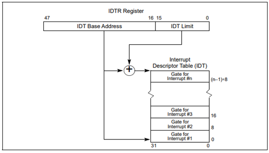
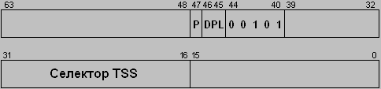
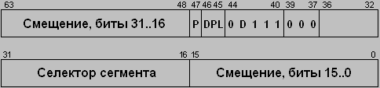
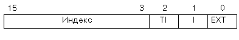
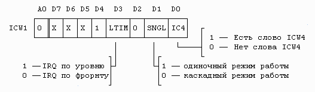
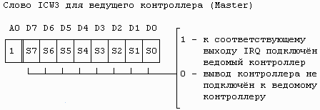
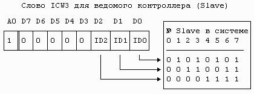
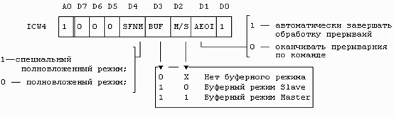
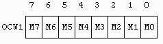
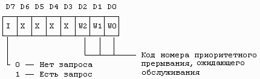

# Лабораторная работа №3

## Контекст
Данная лабораторная работа посвящена изучению механизмов обработки прерываний и исключений в защищённом режиме процессора x86. Студенты научатся работать с таблицей дескрипторов прерываний (IDT), программируемым контроллером прерываний (PIC) и писать собственные обработчики для различных событий, таких как деление на ноль, прерывания клавиатуры и таймера.

Исключения и прерывания в защищённом режиме процессора X86 их обработка.

## Сокращения

- **BIOS** – Base Input/Output System – базовая система ввода/вывода
- **WSL** – Windows Subsystem for Linux – подсистема Windows для Linux
- **MBR** – Master Boot Record – главная загрузочная запись
- **CHS** – Cylinder-Head-Sector – цилиндр-головка-сектор
- **GPT** – GUID (Globally Unique Identifier) Partition Table – таблица разделов глобальных уникальных идентификаторов
- **LBA** – Logical Block Addressing – логическая блочная адресация
- **AT&T** – American Telephone and Telegraph
- **GDT** – Global Descriptor Table – глобальная таблица дескрипторов
- **LDT** – Local Descriptor Table – локальная таблица дескрипторов
- **GDTR** – Global Descriptor Table Register – регистр глобальной таблицы дескрипторов
- **IDT** – Interrupt Descriptor Table – дескрипторная таблица прерываний
- **IDTR** – Interrupt Descriptor Table Register – регистр дескрипторной таблицы прерываний
- **PIC** – Programmable Interrupt Controller – программируемый контроллер прерываний

## Цель работы

Целью данной лабораторной работы является изучение механизма работы обработчика исключений и прерываний, а также написание собственных обработчиков.

В процессе выполнения работы студенты:

- Изучат основные виды исключений и прерываний, их классификацию и особенности
- Поймут причины возникновения исключений и способы их обработки
- Напишут и протестируют собственные обработчики исключений и прерываний

## Необходимые инструменты

- Любой дистрибутив GNU/Linux: рекомендуется Ubuntu, также можно использовать виртуальную машину, например, WSL
- Ассемблер: `as`
- Компоновщик: `ld`
- Утилиты для анализа объектных файлов: `objdump`, `readelf`
- Препроцессор: `cpp`
- Утилита для работы с дисками: `dd`
- Отладчик: `gdb`
- Эмулятор: `qemu`
- Утилиты для автоматизации сборки проектов: `make`

## Исходные файлы лабораторной работы

Файлы, которые используются в лабораторной работе:

- **linker.ld** - скрипт линковщика
- **Makefile** - необходимый для автоматизированной сборки проекта
- **lab3_1.s** - содержит программу с обработчиками различных исключений
- **lab3_2.s** - содержит программу с обработчиками прерываний клавиатуры и таймера
- **gdt.h, idt.h, irq.h** – макросы и константы
- **boot.S** - содержит программу загрузчика
- **Makefile** (для загрузчика) - для автоматизированной сборки загрузчика
- **linker.ld** (для загрузчика) - для сборки загрузчика

## Материалы для подготовки к лабораторной работе

### Понятие прерывания и исключения

**Прерывание (англ. Interrupt)** – это событие, вызывающее прекращение работы основной программы и переход к выполнению процедуры или подпрограммы, предназначенной для его обработки.

Практически все системы ввода/вывода в компьютере работают с использованием прерываний. В частности, когда вы нажимаете клавиши или щёлкаете мышью, аппаратура вырабатывает прерывания. В ответ на них система считывает код нажатой клавиши или запоминает координаты курсора мыши. Прерывания вырабатываются контроллером диска, портами последовательной передачи данных, звуковым адаптером и другими устройствами.

Подробнее о скан-коде можно прочитать: [Скан-код на Википедии](https://ru.wikipedia.org/wiki/%D0%A1%D0%BA%D0%B0%D0%BD-%D0%BA%D0%BE%D0%B4)

Основная цель введения прерываний - реализация асинхронного режима работы и распараллеливания работы отдельных устройств вычислительного комплекса. Механизм прерываний реализуется аппаратно-программными средствами. Прерывание непременно ведёт за собой изменение порядка выполнения команд процессором.

**Главные функции механизма прерывания:**

1. Распознавание или классификация прерывания
2. Передача управления обработчику прерывания
3. Корректное возвращение к прерванной программе

*tр* - время реакции процессора на запрос прерывания; *tс* - время сохранения состояния прерываемой программы и вызова обработчика прерывания; *tв* - время восстановления прерванной программы

**Виды прерываний:**

- **аппаратные прерывания**, которые инициируются внешними устройствами с помощью запросов на прерывания.
- **программные прерывания**, которые инициируются специальными командами (например, int21h для х86).
- **особые случаи или исключения**, вызванные возникновением особых условий (случаев) при выполнении текущей команды.

**Типы внешних прерываний:**

- **Немаскируемые** - обрабатываются всегда, независимо от запретов на другие прерывание. К примеру, такое прерывание может вызвать сбой в микросхеме памяти
- **Маскируемые** - которые можно запрещать установкой соответствующих битов в регистре маскирования прерываний (сбросом флага IF в регистре флагов). Они генерируются контроллером прерываний по заявке определённых периферийных устройств

**Классификация исключений в защищённом режиме:**

- **Нарушение (Fault)** - такой особый случай, который обнаруживается процессором до возникновения фактической ошибки. После устранения обработчиком причины должен быть выполнен рестарт текущей команды.
- **Ловушка (Trap)** - такой особый случай, который обнаруживается процессором после выполнения виновной команды. То есть команда сама инициирует переход к обработчику и после его завершения выполнение прерванной программы продолжается со следующей команды.
- **Аварийное завершение (Abort)** - такой особый случай, при котором нельзя установить его причину и выполнить рестарт команды.

### Основные исключения процессора X86

- **Ошибка деления (0)** – автоматически формируется, когда в команде DIV или IDIV делитель равен нулю или частное слишком велико для получателя (AL, AX, EAX).
- **Отладка (1)** – формируется в следующих случаях:
  - Нарушение к.т. по адресу команды;
  - Нарушение к.т. по адресу данных;
  - Ловушка покомандной работы (TF = 1);
  - Ловушка контрольной точки по переключению задачи (бит Т=1 в сегменте TSS).
- **Немаскируемое прерывание NMI (2)** – единственное внешнее радиальное прерывание.
- **Контрольная точка (3)** – формируется при выполнении однобайтной команды INT3 (код 0cch).
- **Переполнение (4)** – возникает при выполнении команды INT0 при условии, что OF=1.
- **Нарушение границы массива (5)** – возникает при выполнении команды BOUND, если контрольная проверка дает отрицательный результат, т.е. проверяемый (первый) операнд не попадает в диапазон значений, определенных вторым и третьим операндами команды.
- **Недействительный код операции (6)** – генерируется, когда операционное устройство процессора обнаруживает неверный код операции.
- **Устройство недоступно (7)** – возникает в двух случаях:
  - Процессор выполняет команду ESC и бит ЕМ=1 в CR0.
  - Процессор выполняет команду wait или ESC и бит TS=1 в CR1.
- **Двойное нарушение (8)** – когда процессор обнаруживает особый случай при попытке вызвать обработчик предыдущего особого случая, два особых случая обрабатываются последовательно. Если процессор не может их обработать последовательно, формируется особый случай.
- **Недействительный сегмент TSS (10)** – возникает при попытке переключения на задачу с неверным TSS.
- **Неприсутствие сегмента (11)** – формируется, когда бит Р=0 в дескрипторе сегмента.
- **Нарушение стека (12)** – возникает в двух ситуациях:
  - Нарушение предела сегмента при обращении к регистру SS (POP, PUSH, ENTER, MOV AX, [BP+6]);
  - При попытке загрузить в регистр SS дескриптор, который отмечен как неприсутствующий.
- **Нарушение общей защиты (13)** – все нарушения защиты, которые не служат причиной конкретного особого случая:
  - Превышение предела сегмента (кроме стека);
  - Передача управления сегменту, который не является выполняемым;
  - Запись в защищенный от записи сегмент;
  - Считывание из выполняемого сегмента;
  - Загрузка в SS селектора сегмента, защищенного от записи;
  - Загрузка в SS, DS, ES, FS, GS селектора системного сегмента;
  - Загрузка в SS, DS, ES, FS, GS селектора выполняемого сегмента;
  - Переключение на занятую задачу;
  - Нарушение правила привилегий и др.
- **Страничное нарушение (14)** – возникает, когда разрешено страничное преобразование и имеет место одна из ситуаций:
  - В элементе PDE или PTE сброшен бит Р;
  - Процедура не имеет достаточного уровня привилегий для доступа к адресуемой странице.
- **Ошибка операции с плавающей точкой (16)** – сигнализирует об ошибке, возникшей при выполнении команды FPU.
- **Контроль выравнивания (17)** – возникает при нарушении выравнивания операндов. Для реализации контроля выравнивания должны выполняться условия:
  - AM=1 в CR3;
  - AC=1 в EFLAGS;
  - PL=3 для выполняемой программы.

Подробнее можно почитать:

- [OSDev Wiki - Глава 5](https://osdev.fandom.com/ru/wiki/IAM:%D0%93%D0%BB%D0%B0%D0%B2%D0%B0_5)
- [Хабр - Прерывания и исключения](https://habr.com/ru/companies/timeweb/articles/780082/)
- [Дополнительные материалы](https://clck.ru/3GDKjo)

### Таблица прерываний и исключений защищённого режима

Таблица прерываний защищённого режима называется дескрипторной таблицей прерываний IDT (Interrupt Descriptor Table).

Также как и таблицы GDT и LDT, таблица IDT содержит 8-байтовые дескрипторы.

Её расположение определяется содержимым 6-байтового внутреннего регистра процессора IDTR. Формат регистра IDTR полностью аналогичен формату регистра GDTR, для его загрузки используется команда LIDT.

**Формат регистра IDTR:**

Таблица дескрипторов прерываний (IDT) связывает каждый вектор исключения или прерывания с дескриптором шлюза для процедуры или задачи, которая используется для обработки соответствующего исключения или прерывания. Как и GDT (глобальная таблица дескрипторов) и LDT (локальные таблицы дескрипторов), IDT представляет собой массив 8-байтовых дескрипторов (в защищённом режиме). В отличие от GDT, первая запись в IDT может содержать дескриптор. Для формирования индекса в IDT процессор умножает вектор исключения или прерывания на восемь (количество байтов в дескрипторе шлюза). Поскольку существует только 256 векторов прерываний или исключений, в IDT должно находиться не более 256 дескрипторов. Все пустые слоты дескрипторов в IDT должны иметь флаг присутствия (present flag) установленным в 0.

**Структура дескрипторов шлюзов прерываний:**

**Формат шлюза задачи:**

**Формат шлюза прерывания:**

**Формат шлюза ловушки:**

Перед тем, как передать управление обработчику исключения, для многих зарезервированных прерываний аппаратные средства процессора помещают в стек 16-битовый код ошибки. Этот код ошибки программа может проанализировать и тем самым получить некоторую дополнительную информацию об ошибке.

**Формат кода ошибки:**

Поле индекса содержит индекс дескриптора, при обращении к которому произошла ошибка. Поле I, равное 1, означает, что этот индекс относится к таблице IDT. В этом случае произошла ошибка при обработке прерывания или исключения.

Если бит I равен 0, поле TI выбирает таблицу дескрипторов (GDT или LDT) по аналогии с соответствующим полем селектора.

Бит EXT устанавливается в том случае, когда ошибка произошла не в результате выполнения текущей команды, а по внешним относительно выполняемой программы причинам. Например, при обработке аппаратного прерывания от устройства ввода/вывода произошло обращение к отсутствующему в памяти сегменту (у которого в дескрипторе сброшен бит присутствия P).

### Программируемый контроллер прерываний

Программируемый контроллер прерываний (Programmable Interrupt Controller, PIC) отвечает за приём запросов прерываний от различных устройств, их хранение в ожидании обработки, выделение наиболее приоритетного из одновременно присутствующих запросов и выдачу его вектора в процессор, когда последний пожелает обработать прерывание.

**Источники запросов прерываний:**

- IRQ0 - программируемый интервальный таймер или высокоточный таймер событий №0
- IRQ1 - клавиатура PS/2
- IRQ2 - запрос прерывания от ведомого контроллера прерываний
- IRQ3 - произвольное устройство (в IBM PC/AT - последовательный порт COM2 и COM4)
- IRQ4 - произвольное устройство (в IBM PC/AT - последовательный порт COM1 и COM3)
- IRQ5 - произвольное устройство (в IBM PC/AT - параллельный порт LPT2)
- IRQ6 - произвольное устройство (в IBM PC/AT - контроллер гибких дисков)
- IRQ7 - произвольное устройство (в IBM PC/AT - параллельный порт LPT1)
- IRQ8 - часы реального времени или высокоточный таймер событий №1
- IRQ9 - произвольное устройство
- IRQ10 - произвольное устройство
- IRQ11 - произвольное устройство или высокоточный таймер событий №2
- IRQ12 - произвольное устройство, обычно мышь PS/2, либо высокоточный таймер событий №3
- IRQ13 - ошибка арифметического сопроцессора
- IRQ14 - произвольное устройство, обычно первый контроллер ATA (или контроллер Serial ATA в режиме совместимости)
- IRQ15 - произвольное устройство, обычно второй контроллер ATA (или контроллер Serial ATA в режиме совместимости)

Контроллер прерываний (8259A) имеет следующие регистры:

- **IMR** - регистр масок, установленные биты указывают, какие номера прерываний запретить обрабатывать
- **IRR** - регистр запросов на прерывание, содержит номера поступивших запросов на прерывание, бит соответствующему запросу сбрасывается после подтверждения прерывания (IMR на IRR не влияет)
- **ISR** - регистр обслуживаемых прерываний, указывает номера обслуживаемых прерываний

Прерывания от отдельных устройств можно запретить, устанавливая в регистре масок IMR контроллера, соответствующие им биты. Запретить прерывания от всех устройств можно очисткой бита IF в регистре флагов центрального процессора.

Микросхема 8259A позволяет подключать к себе до восьми устройств. Чтобы расширить количество обрабатываемых прерываний, в IBM PC/AT контроллеры прерываний включены каскадом. Один из КП играет роль ведущего (Master), а второй — ведомого (Slave). Выход INTR ведомого контроллера подключён к одному из входов ведущего, а выход INTR ведущего — к соответствующему входу ЦП (см. структуру подключений). Получив от ЦП подтверждение прерывания (по общей для обоих КП шине INTA), если оно относится к ведомому КП, ведущий по локальной шине cas0–cas2 сообщает ведомому, что ведомый должен выдавать вектор прерываний на шину D0–D7.

Перед использованием контроллеров прерываний необходимо выполнить их настройку вначале ведущего КП, а затем ведомого. В процессе настройки ведущего КП нужно, в частности, указать к каким его входам подключены ведомые КП, а ведомого — к какому входу ведущего КП она подключена. К ведущему КП, может подключаться до восьми ведомых КП (в IBM PC используется только один), что в принципе позволяет обрабатывать до 64 запросов прерываний. После того, как ведущий КП передаёт в ЦП запрос на прерывание от ведомого КП и получает подтверждение, он выдаёт на локальную шину cas0–cas2 номер входа, к которому подключён ведомый контроллер. Ведомый контроллер отслеживает состояние входов на шине cas0–cas2, и когда обнаруживает свой номер, обрабатывает подтверждение своего запроса прерывания.

**Структура подключения контроллеров прерываний в IBM AT:**

Команды контроллера делятся на:
- **команды настройки (ICW)**
- **рабочие команды (OCW)**
Вначале рассмотрим команды настройки (командные слова ICW1, ICW2, ICW3 и ICW4). Слово ICW1 начинает процесс настройки КП. Оно задаёт по фронту или по уровню сигнала на входе КП нужно генерировать запрос на прерывание; работает ли контроллер в каскадном режиме (Master или Slave) или самостоятельно, а также имеется ли слово ICW4.

Бит A0 в команде задаётся адресом порта в который она посылается.

**Структура командного слова ICW1:**

Слово ICW1 должно выводиться в порт 20h для ведущего контроллера и в порт 0A0h для ведомого.

Слово ICW2 указывает первый номер вектора прерываний, с которого генерируются все остальные. Этот номер должен быть кратен восьми. Векторы располагаются подряд, начиная с указанного, соответствующего IRQ0, и кончая "указанный+7", соответствующим вектору IRQ7.

**Структура командного слова ICW2:**

Слово ICW2 должно выводиться в порт 21h для ведущего контроллера или в порт 0A1h для ведомого.

**Структура командного слова ICW3:**

Слово ICW3 должно выводиться в порт 21h для ведущего контроллера в порт 0A1h для ведомого.

**Структура командного слова ICW4:**

Слово ICW4 должно выводиться в порт 21h ведущего КП и в порт 0A1h ведомого.

**Порядок настройки контроллера прерываний:**

**Регистр маски**

Регистр IMR доступен для чтения всегда, ISR и IRR — только после выдачи соответствующих команд.

Теперь рассмотрим рабочие команды (OCW1, OCW2 и OCW3).

**Командное слово OCW1**

Для управления регистром маски IMR контроллера прерываний используется командное слово OCW1. Команда OCW1 маскирует отдельные запросы на прерывания. Единичные значения битов указывают, что поступающие запросы на прерывание с соответствующими им номерами игнорируются.

Слово OCW1 должно выводиться в порт 21h ведущего КП и 0A1h ведомого.

**Командное слово OCW2:**

**Назначение битов командного слова OCW2:**

| Бит | Назначение |
|-----|------------|
| R=1 | Управляет операциями, связанными с ротацией приоритетов |
| SL=1 | Указывает, что команда относится к конкретному прерыванию, а не к последнему, подтверждённому на обслуживание (специальное в смысле заданное) |
| EOI=1 | Окончание прерывания (сброс разряда в ISR) |
| L0-L2 | Номер запроса на прерывание, для которого выполняется команда, используется совместно с SL=1 |

Изменение уровней приоритетов вступает в силу только по завершении обработки прерывания (после команды EOI, например).

Когда уровни приоритетов не изменяются, достаточно обычного EOI, когда используются команды ротации приоритетов в обработчике прерываний, нужно использовать специальную команду EOI, явно указывая номер завершаемого прерывания. На использование автоматического завершения прерывания можно программировать контроллер только тогда, когда частота прерываний не очень велика, иначе может возникнуть ситуация сверхвложения (когда одно и то же прерывание вызывается на столько часто, что обработчик не успевает его отработать, при этом оно блокирует вызов всех остальных, и может возникнуть переполнение стека). Если производится ротация приоритетов прерываний, во время обработки прерывания, то приоритеты будут только после окончания обработки (выдачи команды EOI). Т. е. если после ротации приоритетов если, вдруг оказался запрос с более высоким приоритетом, чем у обрабатываемого, то оно обрабатываться не будет до тех пор, пока текущий обработчик прерываний не выдаст команду EOI.
Все возможные варианты расположения уровней приоритетов при ротации:

| Вход микросхемы | Статус уровня приоритета |
|-----------------|--------------------------|
| IRQ0 | 7 6 5 4 3 2 1 0 |
| IRQ1 | 0 7 6 5 4 3 2 1 |
| IRQ2 | 1 0 7 6 5 4 3 2 |
| IRQ3 | 2 1 0 7 6 5 4 3 |
| IRQ4 | 3 2 1 0 7 6 5 4 |
| IRQ5 | 4 3 2 1 0 7 6 5 |
| IRQ6 | 5 4 3 2 1 0 7 6 |
| IRQ7 | 6 5 4 3 2 1 0 7 |

Слово OCW2 должно выводиться в порт 20h для ведущего КП и в порт 0A0h для ведомого. Команда OCW3 используется для выдачи различных режимов и команд в 8259A. OCW3 имеет две функции:

- **Выдаёт состояния прерываний**
- **Управляет маскированием прерываний**

- **Выдаёт состояния прерываний**
- **Управляет маскированием прерываний**

**Назначение битов:**

| Бит | Назначение |
|-----|------------|
| RR=1 | Выполняется команда чтения регистра |
| RIS=0 | Читать IRR; RIS=1 — читать ISR |
| ESMM=1 | Включается или выключается режим специального маскирования |
| SMM=1 | Включить; SMM=0 — выключить |
| P | Выдаётся команда опроса |

Режим опроса необходим, когда устройства имеют общую программу-обработчик прерываний, а также при количестве запросов больше 64. Инициатором опроса является команда, посылающая слово OCW3, по которой микропроцессор блокирует свой вход INTR и подготавливает цепи в КП (контроллере прерываний), необходимые для опроса. Затем в контроллер передаётся команда чтения порта 20h (для ведущего) или A0h (для ведомого КП), по которой по наиболее приоритетному запросу устанавливается соответствующий разряд ISR и сбрасывается одноимённый разряд IRR) и на шину X выдаётся слово опроса прерываний, структура которого следующая:

По полученной информации программа либо перейдёт на программу-обработчик приоритетного прерывания, либо ликвидирует следы обслуживаемого прерывания командой EOI. При необходимости операции опроса может повторяться до тех пор, пока разряд I (D7) не станет равным нулю.

Слово OCW3 выводится в порт 20h ведущего контроллера и в порт 0A0h ведомого контроллера.

Подробнее можно почитать: [Программируемый контроллер прерываний](https://ibzh.eko3.ru/asm/irq.htm)

### Как работать с GDB?

- `b *адрес` - установить точку останова по адресу
- `x/40i` - дизассемблировать 40 инструкций, начиная с адреса
- `display/i $eip` - отображать следующую инструкцию при каждом шаге
- `c` - продолжить выполнения программы до следующей точки останова
- `stepi` - выполнить одну инструкцию (ассемблерный шаг)

## Чеклист выполнения

- [ ] Подготовлена директория `lab3` и созданы необходимые файлы (`lab3_1.s`, `lab3_2.s`, `boot.S`, заголовки).
- [ ] Программа `lab3_1` успешно собрана и запущена.
- [ ] Выполнен тест исключения деления на ноль.
- [ ] Проведен анализ стека до и после исключения в GDB.
- [ ] Выполнены тесты для несуществующей инструкции (UD2), `int 3` и других исключений.
- [ ] Реализован и протестирован обработчик для индивидуального задания (остаток от деления номера группы на 17).
- [ ] Программа `lab3_2` успешно собрана и запущена.
- [ ] Протестирована работа с прерываниями клавиатуры и таймера.
- [ ] Проведены эксперименты с флагом прерываний (IF) и маскированием в PIC.
- [ ] Проверен эффект отсутствия сигнала EOI.
- [ ] Выполнено дополнительное задание (убрать вывод `^` при отжатии клавиши).

## Вопросы для самоконтроля

1. Что такое прерывание и как оно работает в процессоре?
2. Какие виды прерываний существуют (аппаратные, программные, исключения)?
3. В чём разница между немаскируемыми и маскируемыми прерываниями?
4. Какие типы исключений существуют (сбой, ловушка, аварийное завершение)?
5. Что такое IDT (Interrupt Descriptor Table) и как она используется в защищённом режиме?
6. Как процессор определяет, какой обработчик вызвать при возникновении прерывания или исключения?
7. Какие данные хранятся в дескрипторе шлюза прерывания?
8. Как загружается и настраивается IDT?
9. Как процессор обрабатывает исключения, такие как деление на ноль или недопустимый код операции?
10. Что происходит с регистрами и стеком при возникновении исключения?
11. Как написать собственный обработчик исключения на ассемблере?
12. Как установить точку останова в GDB?
13. Как просмотреть состояние регистров и стека в GDB?
14. Как дизассемблировать код в GDB и сравнить его с исходным ассемблерным кодом?

## Выполнение лабораторной работы

### Часть 1. Подготовка к выполнению лабораторной работы

1. Создайте директорию для выполнения лабораторной работы `mkdir lab3` и перейти в неё `cd lab3`, создайте директорию `img`, в ней будут храниться файлы необходимые для загрузчика.
2. Создайте по примеру лабораторной работы №1 необходимые для данной лабораторной работы файлы упомянутые в разделе исходные файлы. Скопируйте код предоставленный в приложении.

### Часть 2. Выполнение лабораторной работы 3_1

#### 2.1. Запуск программы

Запустите программу, наблюдайте успешное выполнение.

#### 2.2. Тест деления на ноль

Отредактируйте файл `lab3_1.S`: расскомментируйте строки кода, где производится деление на 0

#### 2.3. Сборка

Соберите программу, используя команду `make 1`

#### 2.4. Запуск с исключением

Запустите программу с помощью команды `qemu-system-i386 -hda boot.img -m 32`. Посмотрите на вывод текста об исключении

#### 2.5. Анализ адресов

С помощью команды `objdump -m i386 -D lab3_1.elf` вы можете найти адрес обработчика исключений, а также адрес начала стека

#### 2.6. Отладка

Запустите отладчик GDB. Не забудьте добавить флаги `-s -S` в команду `qemu-system-i386 -hda boot.img -m 32`

#### 2.7. Анализ стека

Покажите стек до и после появления исключения, опишите, что в нём присутствует.

**Подсказка:**
- Перейдите на адрес инструкции, которая вызывает исключение
- Вы можете распечатать стек с помощью команды `x/16x $esp+адрес_начала_стека`
- Сделайте шаг в программе с помощью `stepi` (попадёте в обработчик исключения)

**Задание для lab3_1:**

Проведите действия пункта 2.1. - 2.5. для несуществующей инструкции(ud2), int nop nop nop, несуществующего селектора.

Выберите исключение в IDT равное остатку от деления вашего номера в группе на 17 (исключения с null_descr в IDT пропускать), добавьте в код программы действия которые его вызовут и проанализируйте его также, как и предыдущие.

### Часть 3. Выполнение лабораторной работы 3_2

#### 3.1. Сброс флага прерываний

Сбросьте флаг прерываний в обработчике прерывания int 80 (trap_handler).

#### 3.2. Сборка

Соберите программу, используя команду `make 2`

#### 3.3. Запуск и тестирование

Запустите программу с помощью команды `qemu-system-i386 -hda boot.img -m 32`.

Попробуйте ввести текст с клавиатуры, а также обратите внимание на таймер (пока выводится текст на зелёном фоне, если нужно, увеличьте задержку вывода текста).

#### 3.4. Тест с флагом прерываний

Сбросьте флаг прерываний в обработчике прерываний клавиатуры (keyboard_ISR), установите флаг прерываний, пересоберите программу, запустите её.

#### 3.5. Проверка работы

Попробуйте вводить текст с клавиатуры, обратите внимание на вывод текста на зелёном фоне, таймер.

#### 3.6. Запрет прерываний клавиатуры

Запретите прерывания клавиатуры в инициализации регистра маски первого КП, пересоберите программу, запустите её.

#### 3.7. Проверка запрета

Проверьте, что действительно обработки прерываний при нажатии клавиш не происходит.

#### 3.8. Тест без EOI

Верните флаги прерываний, разрешите прерывания клавиатуры, отключите отправку EOI в обработчике прерывания клавиатуры, пересоберите и запустите программу, наблюдайте эффект.

#### 3.9. Отладка

Включив отправку EOI, пересоберите программу, запустите её с поддержкой GDB/

#### 3.10. Исследование обработчиков

Подключившись по GDB исследуйте работу обработчиков прерываний (клавиатуры, таймера, int 80h).

**Дополнительно задание для lab3_2:**

Измените код так, чтобы при отжатии клавиатуры не выводился циркумфлекс (символ `^`)

## Защита

1. Объясните, как процессор обрабатывает прерывания и исключения в защищённом режиме.
2. Какие данные помещаются в стек при возникновении исключения? Как эти данные используются для восстановления состояния программы?
3. В чём разница между сбоем (Fault), ловушкой (Trap) и аварийным завершением (Abort)?
4. Перепишите обработчик прерывания для клавиатуры, так, чтобы он выводил скан-код нажатой клавиши на экран.
5. После возникновения исключения, проверьте содержимое стека. Какие данные были помещены в стек, и как они связаны с состоянием программы до исключения?

## FAQ

**Q: В чем разница между прерыванием и исключением?**
A: **Прерывание (Interrupt)** — это асинхронное событие, инициируемое внешним устройством (например, клавиатурой). **Исключение (Exception)** — это синхронное событие, возникающее в результате выполнения инструкции процессора (например, деление на ноль или ошибка страницы).

**Q: Что такое IDT?**
A: **IDT (Interrupt Descriptor Table)** — это таблица дескрипторов прерываний, которая связывает номер вектора прерывания с адресом его обработчика.

**Q: Зачем нужен контроллер прерываний (PIC)?**
A: **PIC (Programmable Interrupt Controller)** управляет аппаратными прерываниями от внешних устройств, приоритизирует их и передает процессору.

**Q: Что такое EOI?**
A: **EOI (End of Interrupt)** — это команда, которую обработчик прерывания должен отправить контроллеру прерываний, чтобы сообщить о завершении обработки текущего запроса. Без этого контроллер не будет отправлять новые прерывания.

**Q: Что сохраняется в стеке при возникновении исключения?**
A: При возникновении исключения процессор автоматически сохраняет в стек регистр флагов (EFLAGS), сегмент кода (CS) и указатель инструкции (EIP). Для некоторых исключений также сохраняется код ошибки.

## Дополнительные материалы

- [OSDev Wiki - Глава 5](https://osdev.fandom.com/ru/wiki/IAM:%D0%93%D0%BB%D0%B0%D0%B2%D0%B0_5)
- [Хабр - Прерывания и исключения](https://habr.com/ru/companies/timeweb/articles/780082/)
- [Скан-код на Википедии](https://ru.wikipedia.org/wiki/%D0%A1%D0%BA%D0%B0%D0%BD-%D0%BA%D0%BE%D0%B4)
- [Программируемый контроллер прерываний](https://ibzh.eko3.ru/asm/irq.htm)

## Приложение

Полный код программ, Makefile, linker.ld и другие файлы находятся в исходных документах лабораторной работы.

