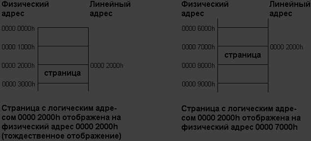
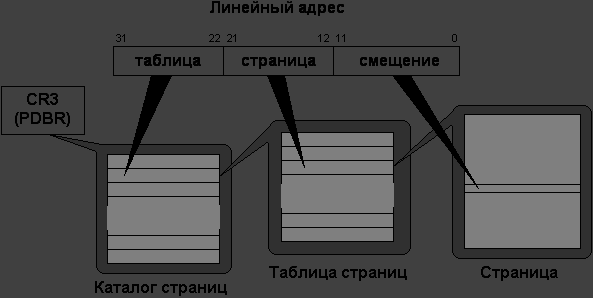
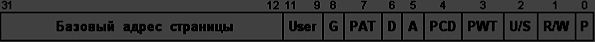
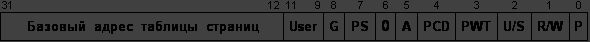
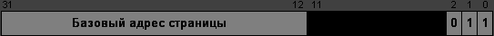

# Лабораторная работа №4

Страничный режим процессора X86.

## Контекст
Данная лабораторная работа посвящена изучению страничной организации памяти в защищённом режиме процессора x86. Студенты познакомятся с механизмами преобразования виртуальных адресов в физические, структурой каталогов (PDE) и таблиц страниц (PTE), а также обработкой исключений страничного нарушения (#PF). Это ключевая тема для понимания работы современных операционных систем и механизмов изоляции памяти.

## Сокращения

- **BIOS** – Base Input/Output System – базовая система ввода/вывода
- **WSL** – Windows Subsystem for Linux – подсистема Windows для Linux
- **MBR** – Master Boot Record – главная загрузочная запись
- **CHS** – Cylinder-Head-Sector – цилиндр-головка-сектор
- **GPT** – GUID (Globally Unique Identifier) Partition Table – таблица разделов глобальных уникальных идентификаторов
- **LBA** – Logical Block Addressing – логическая блочная адресация
- **AT&T** – American Telephone and Telegraph
- **GDT** – Global Descriptor Table – глобальная таблица дескрипторов
- **LDT** – Local Descriptor Table – локальная таблица дескрипторов
- **GDTR** – Global Descriptor Table Register – регистр глобальной таблицы дескрипторов
- **IDT** – Interrupt Descriptor Table – дескрипторная таблица прерываний
- **IDTR** – Interrupt Descriptor Table Register – регистр дескрипторной таблицы прерываний
- **PIC** – Programmable Interrupt Controller – программируемый контроллер прерываний
- **PF** – Page Fault – страничная ошибка
- **PTE** – Page Table Entries – записи таблицы страниц
- **PDE** – Page Directory Entries – записи каталога страниц
- **PDBR** – Page Directory Base Register – регистр базы каталога страниц

## Цель работы

Изучение механизма работы страничного режима и принципов реализации виртуальной памяти.

В процессе выполнения работы студенты:

- Разберутся в основах организации виртуальной памяти.
- Изучат работу страничного режима процессора x86.
- Проведут тестирование исключения #PF (Page Fault).

## Необходимые инструменты

- Любой дистрибутив GNU/Linux: рекомендуется Ubuntu, также можно использовать виртуальную машину, например, WSL
- Ассемблер: `as`
- Компоновщик: `ld`
- Утилиты для анализа объектных файлов: `objdump`, `readelf`
- Препроцессор: `cpp`
- Утилита для работы с дисками: `dd`
- Отладчик: `gdb`
- Эмулятор: `qemu`
- Утилиты для автоматизации сборки проектов: `make`

## Исходные файлы лабораторной работы

- **linker.ld** — скрипт линковщика для основной программы
- **Makefile** — необходимый для автоматизированной сборки проекта
- **lab4.S** — программа с реализацией страничного режима
- **gdt.h, idt.h, irq.h** — заголовочные файлы с макросами и константами
- **boot.S** — код загрузчика
- **Makefile** — для автоматизированной сборки загрузчика
- **linker.ld** — для сборки загрузчика

## Материалы для подготовки к лабораторной работе

### Страничная организация памяти

Механизм управления памятью возможно реализовать только в защищённом режиме. В этом режиме обращение к памяти процессор использует пару значений — селектор:смещение. Адрес указанный таким образом называется логическим адресом, т.к. смещение задаётся относительно начала сегмента, размещённого по любому адресу. С линейными адресами вы уже сталкивались, во 2 и 3 лабораторной работе, когда определяли дескрипторы и регистры IDTR и GDTR, задавая базовые адреса этих объектов. После вычисления линейного адреса процессор преобразует его в физический адрес, по которому и производит обращение к памяти.

**Зачем нужен физический адрес, если линейный адрес уже однозначно определяет доступ к памяти?**

Смысл в использовании линейных и физических адресов появляется, когда программа включает в процессоре механизм трансляции страниц. Страницей называется непрерывная область памяти фиксированного размера размером 4Кб. Всё адресное пространство можно разбить на страницы, получается 2^20 страниц, которые полностью покрывают 32-разрядное адресное пространство:


Адрес страницы памяти всегда кратен 4Кб (1000h байт), т.е. страница может начинаться только с адреса, у которого младшие 3 hex-разряда (или младшие 12 двоичных разрядов) равны нулю. Физическая память - эта та, которая реализована в компьютере в виде микросхем. Вся физическая память делится на физические страницы. Адресное пространство равно 4Гб и оно делится на логические страницы. Таким образом, логические страницы соответствуют физическим страницам или другими словами, логические страницы отображаются на физические страницы.

Страница имеет свой логический адрес, но может быть отображена на любой физический.

Логические страницы являются виртуальными объектами и каждая такая страница имеет два адреса:
- **линейный** - тот, по которому она расположена в адресном пространстве процессора,
- **физический** - тот, на который она отображена в физической памяти компьютера.

Если линейный адрес совпадает с физическим, то страница тождественно отображена.



Теперь очевидна необходимость в преобразовании линейного адреса в физический, т.к. заранее неизвестно, на какую физическую страницу памяти отображена данная логическая страница.

**Доступ к памяти через страницы работает по принципу:**
- выбор страницы – указываем процессору, какую именно страницу использовать (например, через её номер в таблице)
- смещение внутри страницы – задаём 12-битное смещение (поскольку стандартный размер страницы – 4 КБ = 2¹² байт)

Страничная организация памяти позволяет реализовать механизм виртуальной памяти на уровне процессора. В современных компьютерах объем физической памяти часто меньше 4 ГБ, но благодаря тому, что логическую страницу памяти можно отобразить не только на оперативную память, но и на дисковое пространство, фактически доступный объем памяти значительно увеличивается. При этом содержимое неактивных страниц может быть выгружено с диска обратно в ОЗУ по мере необходимости. Таким образом, общий объем используемой памяти ограничивается уже не размером оперативной памяти, а емкостью жесткого диска (или пропускной способностью сети в случае бездисковых систем, где хранение данных осуществляется удаленно).

### Таблицы и каталоги страниц

В программе можно использовать любое количество страниц памяти, но все они должны быть явно определены. Таблицы страниц — массивы, размером 4 Кб, состоящие из 1024 элементов. Таблица страниц должна быть выравнена на границу 4Кб и она хранит описания 1024 страниц, что позволяет описать 4 Мегабайта адресного пространства (1024 страниц по 4Кб каждая). Таблицы страниц группируются в каталог страниц - массив, размером в 4Кб, также состоящий из 1024 элементов. Каждый такой элемент является указателем на таблицу страниц.

Программе совсем не обязательно определять все страницы, таблицы и элементы каталога. Достаточно определить только те, которые реально будут использоваться и динамически добавлять / убирать новые описания в процессе работы. Однако, обязательно нужно определить каталог страниц, а в нём - хотя бы один указатель. То же самое касается таблиц страниц - хотя бы одну с одним элементом.

Для доступа к памяти нужно задать 32-разрядную структуры данных: 10 бит - номер таблицы, ещё 10 - номер страницы в таблице и 12 - смещение внутри самой страницы. Процессор использует описания страниц автоматически. Для этого он преобразует линейные адреса по следующей схеме:



Страничная организация памяти существенно усиливает механизмы защиты ОС, поскольку:
- каждая программа работает со своими виртуальными адресами, не зная реальных физических адресов
- программа не может напрямую обратиться к памяти ядра или других процессов, так как её виртуальные адреса отображаются только на разрешённые физические страницы
- попытка доступа к запрещённой области вызовет исключение #PF (Page Fault), и ОС завершит процесс

### Таблица страниц

Таблица страниц (Page Table) состоит из 4-байтовых элементов (Entries). Эти элементы называются PTE (Page Table Entries) и представляют собой указатели на страницы.



Если страница не присутствует в памяти (бит P=0), то процессор не использует все остальные биты элемента PTE и программа может их использовать по своему усмотрению, например, хранить информацию о том, куда эту страница была перемещена:


**Формат PTE:**

| Бит | Описание |
|-----|----------|
| 0 | **P (Present - присутствие)**. Если 0, то страница не отображена на физическую память. Это значит, что она либо не определена, либо её содержимое было записано на диск операционной системой в процессе свопинга. Если происходит обращение к неприсутствующей странице (у которой бит P = 0), то процессор генерирует исключение страничного нарушения (#PF). |
| 1 | **R / W (Read / Write - Чтение / Запись)**. Если 0, то для этой страницы разрешено только чтение, 1 - чтение и запись. |
| 2 | **U / S (User / Supervisor - Пользователь / Система)**. Если 0, то доступ к странице разрешён только с нулевого уровня привилегий, если 1 - то со всех. |
| 3 | **PWT (Write-Through - Сквозная запись)**. Когда этот флаг установлен, разрешено кэширование сквозной записи (write-through) для данной страницы, когда сброшен - кэширование обратной записи (write-back). |
| 4 | **PCD (Cache Disabled - Кэширование запрещено)**. Когда установлен, кэширование данной страницы запрещено. Кэширование страниц запрещают для портов ввода/вывода, отображённых на память либо в случаях, когда кэширование не даёт выигрыша в производительности. Также, кэширование запрещается при обработке исключений и отладке в ситуациях, связанных с программированием кэшей. Более подробно работа с флагами PWT и PCD описана в разделе "Управление кэшами". |
| 5 | **A (Accessed - Доступ)**. Устанавливается процессором каждый раз, когда он производит обращение к данной странице. Процессор не сбрасывает этот флаг - его может может сбросить программа, чтобы потом, через некоторое время определить, был ли доступ к этой странице, или нет. Например, страницу с флагом A=0 можно не сохранять на диск в процессе свопинга, т.к. она не использовалась. |
| 6 | **D (Dirty - Грязный)**. Устанавливается каждый раз, когда процессор производит запись в данную страницу. Этот флаг также не сбрасывается процессором и может использоваться программой, чтобы определить, была ли запись в страницу или нет. Например, страницу с флагом D=0 можно не сохранять на диск в процессе свопинга, т.к. её содержимое не изменялось. |
| 7 | **PAT (Page Table Attribute Index - Индекс атрибута таблицы страниц)**. Для процессоров, которые используют таблицу атрибутов страниц (PAT - page attribute table), этот флаг используется совместно с флагами PCD и PWT для выбора элемента в PAT, который выбирает тип памяти для страницы. Этот бит введён в процессоре Pentium III, а для процессоров, не использующих PAT, бит PAT должен быть равен 0. |
| 8 | **G (Global Page - Глобальная страница)**. Когда установлен, определяет глобальную страницу. Такая страница остаётся достоверной в кэшах TLB при перезагрузке регистра CR3 или переключении задач. Этот бит введён в Pentium Pro и работа с ним подробно описана в "Управлении кэшами". Для процессоров, младше Pentium Pro, этот бит зарезервирован и должен быть равен 0. |
| 9..11 | Доступно для использования программой. Процессор не использует эти биты. |
| 12..31 | Базовый адрес страницы - это адрес, с которого начинается страница, другими словами - это физический адрес, на который отображена данная страница. |

В рамках данного изучения мы ограничимся базовой конфигурацией страничной организации памяти:
- мы будем работать исключительно с 4Кб страницами, без использования механизмов кэширования
- биты U/S, PWT, PCD, PAT и G везде будут установлены в 0

### Каталог страниц

Каталог страниц - это массив размером в 4Кб, состоящий из 4-байтовых элементов PDE (Page Directory Entries). Каждый элемент указывает на таблицу страниц и по формату почти совпадает с PTE. Элемент PDE определяет положение таблицы страниц, указывая адрес физической страницы памяти.



Если таблица страниц не присутствует в памяти (бит P=0), то процессор не использует все остальные биты элемента PDE и программа может их использовать по своему усмотрению, например, хранить информацию о том, куда эту таблица страниц была перемещена:

Для начала мы будем использовать модель памяти процессора i368, поэтому флаги U/S, PWT, PCD и PS будем устанавливать в 0.

**Формат PDE** (все флаги в элементе PDE действуют на соответствующую таблицу страниц):

| Бит | Описание |
|-----|----------|
| 0 | **P (Present - присутствие)**. Если 0, то таблица страниц не отображена на физическую память. Это значит, что она либо не определена, либо её содержимое было записано на диск операционной системой в процессе свопинга. Если происходит обращение к неприсутствующей таблице страниц (у которой бит P = 0), то процессор генерирует исключение страничного нарушения (#PF). |
| 1 | **R / W (Read / Write - Чтение / Запись)**. Если 0, то для всех страниц этой таблицы разрешено только чтение, 1 - чтение и запись. |
| 2 | **U / S (User / Supervisor - Пользователь / Система)**. Если 0, то доступ ко всем страницам данной таблицы разрешён только с нулевого уровня привилегий, если 1 - то со всех. |
| 3 | **PWT (Write-Through - Сквозная запись)**. Когда этот флаг установлен, разрешено кэширование сквозной записи (write-through) для всех страниц данной таблицы страниц, когда сброшен - разрешено кэширование обратной записи (write-back). |
| 4 | **PCD (Cache Disabled - Кэширование запрещено)**. Когда установлен, кэширование всех страниц данной таблицы страниц запрещено. Кэширование страниц запрещают для портов ввода/вывода, отображённых на память либо в случаях, когда кэширование не даёт выигрыша в производительности. Также, кэширование запрещается при обработке исключений и отладке в ситуациях, связанных с программированием кэшей. Более подробно работа с флагами PWT и PCD описана в разделе "Управление кэшами". |
| 5 | **A (Accessed - Доступ)**. Устанавливается процессором каждый раз, когда он производит обращение к страницам данной таблицы страниц. Процессор не сбрасывает этот флаг - его может может сбросить программа, чтобы потом, через некоторое время определить, был ли доступ к этой таблице страниц, или нет. |
| 6 | 0 (зарезервировано). |
| 7 | **PS (Page size - Размер страницы)**. Если 0, то используются страницы размером 4Кб и данный элемент PDE указывает на таблицу страниц. Если флаг PS установлен в 1, то данный элемент PDE указывает на страницу размером 4Мб (для 32-разрядной адресации), либо размером 2Мб (при расширенной физической адресации). |
| 8 | **G (Global Page - Глобальная страница)**. В PDE этот бит процессором игнорируется. |
| 9..11 | Доступно для использования программой. Процессор не использует эти биты. |
| 12..31 | Базовый адрес таблицы страниц - это адрес, с которого начинается таблица страниц, другими словами - это физический адрес, на который она отображена. |

### Регистр PDBR

Для того, чтобы процессор мог использовать страничное преобразование, ему необходимо указать адрес начала каталога страниц. Этот адрес хранится в регистре PDBR (Page Directory Base Register - регистр базы каталога страниц). Функцию этого регистра выполняет регистр управления CR3, т.е. PDBR - это синоним CR3.

Т.к. каталог страниц должен быть выравнен на границу 4Кб, его адрес будет содержать нули в младших 12 разрядах, а 20 старших, следовательно, будут нести информацию. Эти 20 разрядов и хранятся в регистре CR3. Оставшиеся 12 бит в CR3 зарезервированы.

**Формат регистра CR3:**


Для того, чтобы загрузить значение в CR3, можно использовать только команду MOV (как и для всех регистров управления). Т.к. регистры управления - 32-разрядные, то вторым операндом команды MOV должен быть 32-разрядный регистр общего назначения (как правило, это EAX).

### Включение страничного преобразования

Для активации страничной адресации в программе необходимо выполнить три ключевых шага:

1. подготовить описания всех используемых в программе страниц, таблиц страниц и каталога страниц
2. загрузить адрес начала (т.е. базовый адрес) каталога страниц в CR3
3. разрешить в процессоре страничное преобразование

**Простой вид элемента PTE:**



Для того, чтобы включить или, другими словами, разрешить в процессоре страничное преобразование, необходимо установить бит PG (это 31-й бит) в регистре управления CR0. После того, как это будет сделано, нужно выполнить команду перехода - она заставит процессор сбросит конвейер и начать выборку команд уже используя механизм трансляции страниц. Перед возвратом программы в режим реальных адресов нужно запретить страничное преобразование -     сбросить бит PG в CR0 и выполнить команду перехода

## Чеклист выполнения

- [ ] Подготовлена директория `lab4` и созданы необходимые файлы.
- [ ] Программа успешно собрана с помощью `make` и запущена.
- [ ] Выполнен запуск с отладчиком GDB.
- [ ] Исследована память по адресу 0x9000 (каталог страниц) в GDB.
- [ ] Проанализировано содержимое таблиц страниц до и после инициализации.
- [ ] Изучены значения регистров CR3 и CR0.
- [ ] Выполнено сопоставление линейных и физических адресов в GDB.
- [ ] Выбран и реализован вариант индивидуального задания.
- [ ] Создан дескриптор с правами только на чтение для области памяти.
- [ ] Реализовано заполнение сегмента данными при включенном страничном преобразовании.
- [ ] Выполнена проверка записанных данных при выключенном страничном преобразовании.
- [ ] Продемонстрирован обмен записей страниц (swapping) и его влияние на чтение данных.

## Выполнение лабораторной работы

### Часть 1. Подготовка к выполнению лабораторной работы

1. Создайте директорию для выполнения лабораторной работы `mkdir lab4` и перейти в неё `cd lab4`, создайте директорию `img`, в ней будут храниться файлы необходимые для загрузчика.
2. Создайте по примеру лабораторной работы №3 необходимые для данной лабораторной работы файлы упомянутые в разделе исходные файлы. Скопируйте код предоставленный в приложении.

### Часть 2. Выполнение лабораторной работы 4

1. Соберите программу с помощью `make`, запустите её, наблюдайте успешное выполнение.
2. Запустите программу с поддержкой GDB, и подключитесь через него.
3. Установите точку останова в начале функции `set_pages`(адрес начала определите используя инструментарий, который применяли во время выполнения предыдущих работ) и продолжите выполнение.
4. Исследуйте память по адресу 0x9000 (будущий каталог страниц).
5. Установите точку останова после заполнения каталога страниц, перед инициализацией первой таблицы страниц, и продолжите выполнение, проанализируйте содержимое каталога страниц.
6. Проанализируйте содержимое таблиц страниц до и после инициализации.
7. Изучите содержимое регистров CR3, CR0.
8. В GDB выведите содержимое сегмента данных используя первую таблицу страниц(адреса тождественны), определите используя теорию линейный адрес которому соответствует этот же физический адрес при обращении через вторую таблицу страниц.

### Часть 3. Индивидуальное задание

Выберите из таблицы вариант соответствующий вашему номеру в списке группы.

| Вариант | Расположение в адресном пространстве | Базовый адрес сегмента каталога и таблиц страниц | Номер страницы с каталогом в сегменте | i | j |
|---------|--------------------------------------|------------------------------------------------|--------------------------------------|---|---|
| 1 | 4/4 | 9000 | 1 | 1 | 14 |
| 2 | 3/4 | a000 | 2 | 2 | 11 |
| 3 | 2/4 | 1000 | 4 | 3 | 5 |
| 4 | 8/8 | b000 | 3 | 5 | 3 |
| 5 | 6/8 | 2000 | 5 | 7 | 9 |
| 6 | 4/8 | 3000 | 1 | 9 | 10 |
| 7 | 2/8 | 11000 | 2 | 11 | 8 |
| 8 | 16/16 | c000 | 3 | 14 | 12 |
| 9 | 14/16 | d000 | 4 | 1 | 3 |
| 10 | 12/16 | e000 | 5 | 2 | 4 |
| 11 | 10/16 | 0000 | 1 | 3 | 5 |
| 12 | 8/16 | 4000 | 2 | 4 | 6 |
| 13 | 6/16 | 1000 | 3 | 5 | 1 |
| 14 | 4/16 | 9000 | 4 | 6 | 2 |
| 15 | 2/16 | b000 | 5 | 7 | 3 |
| 16 | 15/16 | 2000 | 1 | 8 | 7 |
| 17 | 3/4 | a000 | 3 | 14 | 12 |
| 18 | 8/8 | 3000 | 2 | 6 | 2 |
| 19 | 10/16 | f000 | 4 | 3 | 5 |
| 20 | 12/16 | 10000 | 5 | 5 | 3 |
| 21 | 8/16 | 2000 | 3 | 7 | 9 |

В соответствии с вариантом вам необходимо определить область физической памяти, на которую вам необходимо будет отобразить сегмент заданного размера (например, дробь 7/8 означает что необходимо отобразить 1024 КБ/8 = 128 КБ на физическую область памяти начиная с адреса 0x1C0000(используем только второй мегабайт физической памяти)). Также необходимо добавить дескриптор с правами только на чтение который будет описывать данный сегмент памяти при выключенном страничном преобразовании. Затем с включенным страничным преобразованием необходимо заполнить данный сегмент возрастающими двойными словами, выключить страничное преобразование и прочитать записанные данные, совпадение записанных и считанных данных является доказательством успешного выполнения лабораторной работы. Также необходимо учесть, что в сегменте, содержащем каталог и таблицы страниц, каталог страниц должен находиться на странице с номером внутри сегмента соответствующем варианту. Базовый адрес данного сегмента также указан в таблице. Записи для страниц с номерами i и j в таблице страниц необходимо поменять местами, в дальнейшем при чтении без страничного преобразования необходимо пронаблюдать результат этого действия.

## FAQ

**Q: Зачем нужна страничная организация памяти?**
A: Она позволяет виртуализировать память, предоставляя каждому процессу собственное адресное пространство, изолированное от других. Также она позволяет использовать больше памяти, чем физически установлено (свопинг), и гибко управлять правами доступа.

**Q: Что такое CR3?**
A: **CR3 (Page Directory Base Register, PDBR)** — это управляющий регистр процессора, который хранит физический адрес начала каталога страниц текущей задачи.

**Q: В чем разница между PDE и PTE?**
A: **PDE (Page Directory Entry)** — это запись в каталоге страниц, указывающая на таблицу страниц. **PTE (Page Table Entry)** — это запись в таблице страниц, указывающая на физическую страницу памяти.

**Q: Что такое TLB?**
A: **TLB (Translation Lookaside Buffer)** — это кэш процессора, который хранит последние результаты трансляции виртуальных адресов в физические, ускоряя доступ к памяти.

**Q: Когда возникает исключение #PF (Page Fault)?**
A: Оно возникает, когда процессор не может транслировать виртуальный адрес в физический (например, страница не присутствует в памяти, бит P=0) или при нарушении прав доступа (например, попытка записи в страницу только для чтения).

## Дополнительные материалы

- [Intel® 64 and IA-32 Architectures Software Developer’s Manuals](https://www.intel.com/content/www/us/en/developer/articles/technical/intel-sdm.html)
- [OSDev Wiki: Paging](https://wiki.osdev.org/Paging)
- [OSDev Wiki: Page Directory](https://wiki.osdev.org/Page_Directory)
- [OSDev Wiki: Page Table](https://wiki.osdev.org/Page_Table)
- [Виртуальная память (Habr)](https://habr.com/ru/post/170929/)

## Приложение

### Makefile

```makefile
all: lab4.bin img/boot.img
	dd if=img/boot.img of=disk.img # Копируем загрузочный образ
	dd if=lab4.bin of=disk.img seek=1 bs=512 conv=notrunc # Записываем программу после загрузчика
lab4.o: lab4.S
	cpp -o lab4.s lab4.S # Разворачиваем макрорасширения
	as --32 -o lab4.o lab4.s # Компилируем программу для архитектуры x86
lab4.bin: lab4.o
	ld --gc-sections -m elf_i386 -T linker.ld -o lab4.elf lab4.o # Связываем объектный файл lab4.o с использованием скрипта линкера linker.ld, создавая ELF-файл lab4.elf. Флаг --gc-sections удаляет неиспользуемые секции для оптимизации.
	objcopy -S -O binary lab4.elf lab4.bin # Конвертируем ELF-файл lab4.elf в чистый бинарный файл lab4.bin. Флаг -S исключает символы и отладочную информацию, а -O binary указывает формат вывода.
img/boot.img:
	$(MAKE) -C img/ # Собираем загрузчик

clean:
	rm *.o *.elf  *.img # Удаляем всё лишнее
```

### linker.ld

```ld
ENTRY(_start)  /* Точка входа программы */


SECTIONS {     /* Определение секций */
    . = 0x8000; /* Адрес начала секции .text */
    .text : {   /* Секция кода */
        *(.text) /* Включаем все секции .text */
    }

    .data : {   /* Секция инициализированных данных */
        *(.data) /* Включаем все секции .data */
    }

    .stack : {  /* Секция стека */
        *(.stack)
    }

    /DISCARD/ : { /* Исключаем ненужные секции */
        *(.note*)
        *(.comment)
        *(.gnu*)
    }
}
```

### Makefile

```makefile
all: lab4.bin img/boot.img
```

### lab4.S

```assembly
#include "gdt.h"
#include "idt.h"
#include "irq.h"

#define CS  0x8                 // селектор сегмента кода
#define DS  0x10                // селектор сегмента данных
#define SS  0x18                // селектор сегмента стека
#define ES  0x20                // селектор сегмента видеобуфера
#define FS  0x28                // селектор дополнительного сегмента данных
#define STACK_SIZE  0x100       // размер стека

#define SCREEN_ROWS 25
#define SCREEN_COLS 80
#define MAX_COLS    60

#define TIMER_ROW   1
#define TIMER_COL   65

/*------------------------------------------------------
    Загрузчик первой стадии (GRUB) загружает образ программы начиная со 2 селектора
    по адресу 0x0000:0x8000 и передает на него управление: ip = 0x8000
    Процессор находится в реальном режиме

    Значения сегментных регистров:
    cs = 0x0    ds = 0x0    es = 0x0
    ss = 0x0    fs = 0x0    gs = 0x0
-------------------------------------------------------*/
/*---------------------------------------- Начало секции кода ----------------------------------------*/

.code16
.text

.global _start
_start:
    movw    $0x3, %ax           // очистка экрана: задаем режим видеоадаптера (80x25, 16-цветный)
    int     $0x10               // используем 0x10 прерывание BIOS (ah = 0, al = 3)
    movw    $.data, %ax
    movw    $seg_data, %bx      // записываем базовый адрес семента данных в соответствующий дескриптор
    movw    %ax, 2(%bx)
    movw    $.stack, %ax        // записываем базовый адрес сегмента стека в соответствующий дескриптор
    movw    $seg_stack, %bx
    movw    %ax, 2(%bx)         // (для кода и видеобуфера базовые адреса известны)
    movw $0x100, %ax
    movw %ax, %sp    

    cli                         // запрещаем аппаратные прерывания
    movb    $0x80, %al
    outb    %al, $0x70          // запрещаем NMI (немаскируемые прерывания)
    inb     $0x92, %al          // включаем А20 адресную линию
    orb     $0x2, %al
    outb    %al, $0x92
    
  
    lgdt    gdtdesc             // загружаем значение GDTR
    lidt    idtdesc             // загружаем значение IDTR

    movl    %cr0, %eax
    orl     $1, %eax
    movl    %eax, %cr0                  // устанавливаем бит PE в регистре CR0

    ljmp    $CS, $CS_OFF(goto_prot)     // переходим в новый сегмент кода (cs, ip)
/*---------------------------------------- Теперь процессор работает в защищенном режиме ----------------------------------------*/

.code32                                 // указание процессору генерировать 32-разрядный код
goto_prot:
    movw    $DS, %ax
    movw    %ax, %ds                    // загружаем новый селектор сегмента данных
    movw    $SS, %ax
    movw    %ax, %ss				    // загружаем новый селектор сегмента стека
    movl    $STACK_SIZE, %esp           // устанавливаем указатель стека на значение на значение "дна" стека
    movw    $ES, %ax
    movw    %ax, %es                    // загружаем селектор сегмента видеобуфера
    movw    $FS, %ax
    movw    %ax, %fs
    call    init_pic                    // инициализация контроллеров прерываний
    movb    $0, %al                     // разрешаем немаскируемые прерывания
    outb    %al, $0x70
    sti                                 // разрешаем прерывания

    call set_pages

    movw    $320, %bx                   // начальное смещение на экране
    movw    $110, %cx                   // число выводимых символов
    movw    $0x1e01, %ax                // загружаем начальный символ с атрибутом

screen:
    movw    %ax, %es:(%bx)          // записываем очередной символ в видеопамять
    addw    $2, %bx                 // смещаемся в видеобуфере
    incw    %ax                     // код следующего символа
    pushw   %cx                     // сохраняем cx
    movl    $0x0FFFFF, %ecx         // добавим паузу для наглядности

pause:
    nop
    loop    pause       // цикл паузы
    popw    %cx         // возвращаем cx
    loop    screen      // цикл вывода на экран

    int $0x80
    movw $0x30, %ax
    movw %ax, %gs

    // Демонстрация записи через вторую таблицу и чтения через первую
    movl    $DS_OFF(mesg_write_test), %esi
    call    print_str
    
    // Записываем тестовое значение 0xCAFE через вторую таблицу страниц
    // Адрес 0x400100 во второй таблице отображается на физический адрес 0x2100
    movl    $0x400100, %ebx
    movl    $0xABCDEFED, (%ebx)
    
    // Выводим значение, которое записали
    movl    $DS_OFF(mesg_wrote), %esi
    call    print_str
    movl    $0xABCDEFED, %eax
    call    print_hex
    call    print_endl
    
    // Теперь читаем то же значение через первую таблицу страниц
    // Адрес 0x2100 в первой таблице отображается на тот же физический адрес 0x2100
    movl    $0x2100, %ebx
    movl    (%ebx), %eax
    
    // Выводим прочитанное значение
    movl    $DS_OFF(mesg_read1), %esi
    call    print_str
    call    print_hex
    call    print_endl
    
    // Выводим успешное сообщение, если значения совпадают
    cmpl    $0xABCDEFED, %eax
    jne     mismatch
    
    movl    $DS_OFF(mesg_match), %esi
    call    print_str
    call    print_endl
    jmp     hang
    
mismatch:
    movl    $DS_OFF(mesg_mismatch), %esi
    call    print_str
    call    print_endl
    
hang:
    nop
    jmp     hang        // зацикливание


set_pages:
	
	movw $FS, %ax
	movw %ax, %es

    movl $0, %edi // базовый адрес каталога страниц (0x28:0x00) 0x28 - селектор дескриптора с базой 0x9000, т.е. физический адрес каталога страниц 0x9000

    # Инициализация страницы каталога
    xorl %eax, %eax         # Обнуляем EAX
    movw $0x400, %cx        # 1024 записи в странице каталога
    cld                     # Устанавливаем направление вперед
    rep stosl               # Заполняем все записи нулями = > имеем 4КБ начиная с 0x9000 заполненых нулями
    movl $0, %edi           # Адрес страницы каталога

    # Настройка первой записи страницы каталога
    movl $0xa000 | 0x03, %eax       # Адрес таблицы страниц + флаги (присутствует, читаемо-записываемо) адрес в физической памяти
    movl %eax, %fs:(%edi)           # Записываем адрес таблицы страниц в первую ячейку страницы каталога

    movl $0x1000, %edi              # Возвращаем указатель на начало таблицы страниц (0x28:0x1000 => 0xa000)
    # Инициализация таблицы страниц
    xorl %eax, %eax                 # Обнуляем EAX
    movw $0x400, %cx                # 1024 записи в таблице страниц
    rep stosl                       # Заполняем все записи нулями = > имеем 4КБ начиная с 0xa000 заполненых нулями

    movl $0x1000, %edi              # Возвращаем указатель на начало таблицы страниц (0x28:0x1000 => 0xa000)

    # Настройка записей таблицы страниц
    xorl %eax, %eax             # Обнуляем EAX
    movl $0x03, %eax            # флаги присутствует, читаемо-записываемо
    movw $0xff, %cx             # Инициализируем 256 записей таблицы страниц
tab1:
    movl %eax, %fs:(%edi)       # Записываем адрес страницы в текущую ячейку
    addl $0x1000, %eax          # Переходим к следующей странице
    addl $4, %edi               # Переходим к следующей записи в таблице страниц
    loop tab1

    movl $0x04, %edi            # Адрес страницы каталога со смещением в одну запись
    # Настройка второй записи страницы каталога
    movl $0xb000 | 0x03, %eax   # Адрес таблицы страниц + флаги (присутствует, читаемо-записываемо) адрес в физической памяти
    movl %eax, %fs:(%edi)       # Записываем адрес таблицы страниц во вторую ячейку страницы каталога

    movl $0x2000, %edi          # Возвращаем указатель на начало таблицы страниц (0x28:0x2000 => 0xb000)
    # Инициализация таблицы страниц
    xorl %eax, %eax             # Обнуляем EAX
    movw $0x400, %cx            # 1024 записи в таблице страниц
    rep stosl                   # Заполняем все записи нулями

    movl $0x2000, %edi          # Возвращаем указатель на начало таблицы страниц (0x28:0x2000 => 0xb000)

    # Настройка записей таблицы страниц
    xorl %eax, %eax              # Обнуляем EAX
    movl $0x2003, %eax             # флаги присутствует, читаемо-записываемо
    movw $0xff, %cx              # Инициализируем первые 256 записей таблицы страниц
tab2:
    movl %eax, %fs:(%edi)       # Записываем адрес страницы в текущую ячейку
    addl $0x1000, %eax          # Переходим к следующей странице
    addl $4, %edi               # Переходим к следующей записи в таблице страниц
    loop tab2
    
    xorl %eax, %eax             # Обнуляем EAX
    # Установка PDBR (CR3) на адрес страницы каталога
    movl $0x9000, %eax          # Адрес страницы каталога
    movl %eax, %cr3             # Загружаем адрес в CR3 (PDBR)

    movl    %cr0, %eax
    orl     $0x80000001, %eax
    movl    %eax, %cr0                  // устанавливаем бит PE в регистре CR0

    movw $ES, %ax
    movw %ax, %es

    ret


init_pic:
    pushw   %ax

    movb    $(ICW1_INIT | ICW1_ICW4_NEEDED), %al    // запись 1-ого слова инициализации в регистр команд
    outb    %al, $MASTER_PIC_COMMAND
    nop
    outb    %al, $SLAVE_PIC_COMMAND
    nop

    movb    $ICW2_MASTER_BASE_VECTOR, %al       // запись базового вектора прерываний для обоих контрллеров
    outb    %al, $MASTER_PIC_DATA
    nop
    movb    $ICW2_SLAVE_BASE_VECTOR, %al
    outb    %al, $SLAVE_PIC_DATA
    nop

    movb    $ICW3_MASTER, %al           // указание линии IRQ, к которой подключен SLAVE-контроллер
    outb    %al, $MASTER_PIC_DATA
    nop
    movb    $ICW3_SLAVE, %al            // указываем номер SLAVE-контроллера в каскаде
    outb    %al, $SLAVE_PIC_DATA
    nop

    movb    $ICW4_8086_MODE, %al        // запись последнего слова инициализации
    outb    %al, $MASTER_PIC_COMMAND
    nop
    outb    %al, $SLAVE_PIC_COMMAND
    nop

    movb    $(IRQ2|IRQ3|IRQ4|IRQ5|IRQ6|IRQ7), %al   // инициализация регистров маски обоих контроллеров
    outb    %al, $MASTER_PIC_DATA

    movb    $(IRQ0|IRQ1|IRQ2|IRQ3|IRQ4|IRQ5|IRQ6|IRQ7), %al
    outb    %al, $SLAVE_PIC_DATA

    popw    %ax
    ret

/*------------------------------------------------------
    Процедуры обработки исключений. Для каждого исключения выводится символическая
    строка с его названием и значение регистра SP. Для некоторых исключений
    предпринимаются попытки восстановления. Исключения без собственного обработчика
    перенаправляются на псевдообработчик (dummy_handler)
-------------------------------------------------------*/

/*  Обработка исключения 0: Ошибка деления (DE) */
divide_error_handler:
    pushl   %ebp
    movl    %esp, %ebp                  // инициализация указателя кадра стека
    pushl   %eax                        // сохраняем затрагиваемые регистры в стеке
    pushl   %esi
    movl    $DS_OFF(mesg_DE), %esi      // адрес строки с названием исключения в ESI
    movl    %esp, %eax                  // значение ESP при выходе в обработчик в EAX
    addl    $12, %eax
    call    print_str                   // вывод строки
    call    print_hex                   // вывод указателя стека
    call    print_endl                  // переход на следующую строку
    addw    $2, 4(%ebp)
    popl    %esi
    popl    %eax                        // возврат регистров из стека
    popl    %ebp
    iret                                // возврат из прерывания

/*  Обработка исключения 1: Исключение отладки (DB) */
debug_exception_handler:
    pushl   %ebp
    movl    %esp, %ebp                  // инициализация указателя кадра стека
    pushl   %eax                        // сохраняем затрагиваемые регистры в стеке
    pushl   %esi
    movl    $DS_OFF(mesg_DB), %esi      // адрес строки с названием исключения в ESI
    movl    %esp, %eax                  // значение ESP при выходе в обработчик в EAX
    addl    $12, %eax
    call    print_str                   // вывод строки
    call    print_hex                   // вывод указателя стека

    movl    $DS_OFF(mesg_DB2), %esi
    addl    12(%ebp), %eax              // считываем значение регистра флагов
    call    print_str
    call    print_hex                   // выводим регистр флагов

    call    print_endl                  // переход на следующую строку
    popl    %esi
    popl    %eax                        // возврат регистров из стека
    popl    %ebp
    iret                                // возврат из прерывания

/*  Обработка исключения 3: Контрольная точка (BP) */
breakpoint_handler:
    pushl   %eax
    pushl   %esi                        // сохраняем затрагиваемые регистры в стеке
    movl    $DS_OFF(mesg_BP), %esi      // адрес строки с названием исключения в ESI
    movl    %esp, %eax
    addl    $8, %eax                    // значение ESP при выходе в обработчик в EAX
    call    print_str
    call    print_hex                   // вывод на экран
    call    print_endl
    popl    %esi                        // возрат регистров из стека
    popl    %eax
    iret                                // возврат из прерывания

/*  Обработка исключения 4: Переполнение (OF) */
overflow_handler:
    pushl   %eax
    pushl   %esi                        // сохраняем затрагиваемые регистры в стеке
    movl    $DS_OFF(mesg_OF), %esi      // адрес строки с названием исключения в ESI
    movl    %esp, %eax
    addl    $8, %eax                    // значение ESP при выходе в обработчик в EAX
    call    print_str
    call    print_hex                   // вывод на экран
    call    print_endl
    popl    %esi                        // возрат регистров из стека
    popl    %eax
    iret                                // возврат из прерывания

/*  Обработка исключения 6: Недопустимая команда (UD) */
inval_opcode_handler:
    pushl   %eax
    pushl   %esi                        // сохраняем затрагиваемые регистры в стеке
    movl    $DS_OFF(mesg_UD), %esi      // адрес строки с названием исключения в ESI
    movl    %esp, %eax
    addl    $8, %eax                    // значение ESP при выходе в обработчик в EAX
    call    print_str
    call    print_hex                   // вывод на экран
    call    print_endl
    popl    %esi                        // возрат регистров из стека
    popl    %eax
0:
    jmp     0b

/*  Обработка исключения 10: Недопустимый TSS (TS) */
inval_tss_handler:
    jmp     inval_tss_handler

/*  Обработка исключения 11: Сегмент отсутствует в памяти (NP) */
seg_not_present_handler:
    pushl   %ebp
    movl    %esp, %ebp                  // инициализация указателя кадра стека
    pushl   %eax
    pushl   %esi
    movl    $DS_OFF(mesg_NP), %esi      // адрес строки с названием исключения в ESI
    movl    %esp, %eax
    addl    $12, %eax                   // значение ESP при входе в обработчик в EAX
    call    print_str
    call    print_hex
    call    print_endl

    movl    4(%ebp), %eax               // считываем код ошибки - селектор отсутствующего сегмента
    movl    $DS_OFF(GDT), %esi
    addl    %eax, %esi                  // получаем адре дескриптора в GDT
    movb    5(%esi), %al
    orb     $0x80, %al                  // устанавливаем бит присутствия "P" в дескрипторе сегмента
    movb    %al, 5(%esi)

    popl    %esi
    popl    %eax                        // возврат регистров из стека
    popl    %ebp
    addl    $4, %esp                    // удаляем код ошибки (4б) из стека
    iret                                // чтобы корректно выйти из прерывания
/*  Обработка исключения 12: Ошибка сегмента стека (SS) */
stack_seg_fault_handler:
    pushl   %eax
    pushl   %esi                        // сохраняем затрагиваемые регистры в стеке
    movl    $DS_OFF(mesg_SS), %esi      // адрес строки с названием исключения в ESI
    movl    %esp, %eax
    addl    $8, %eax                    // значение ESP при выходе в обработчик в EAX
    call    print_str
    call    print_hex                   // вывод на экран
    call    print_endl
    popl    %esi                        // возрат регистров из стека
    popl    %eax
0:
    jmp     0b

/*  Обработка исключения 13: Общее исключение защиты (GP) */
gen_prot_fault_handler:
    pushl   %eax
    pushl   %esi                        // сохраняем затрагиваемые регистры в стеке
    movl    $DS_OFF(mesg_GP), %esi      // адрес строки с названием исключения в ESI
    movl    %esp, %eax
    addl    $8, %eax                    // значение ESP при выходе в обработчик в EAX
    call    print_str
    call    print_hex                   // вывод на экран
    call    print_endl
    popl    %esi                        // возрат регистров из стека
    popl    %eax
0:
    jmp     0b

/*  Обработка исключения 14: Страничное нарушение (PF) */
page_fault_handler:
    pushl   %ebp
    movl    %esp, %ebp
    pushl   %eax
    pushl   %ebx
    pushl   %ecx
    pushl   %esi
    pushl   %edi
    
    movl    $DS_OFF(mesg_PF), %esi
    call    print_str
    
    movl    8(%ebp), %eax      // Получаем код ошибки
    call    print_hex          // Выводим код ошибки
    call    print_endl
    
    movl    $DS_OFF(mesg_addr), %esi
    call    print_str
    
    movl    %cr2, %eax         // Получаем адрес, вызвавший ошибку
    call    print_hex          // Выводим адрес
    call    print_endl
    
    movl    8(%ebp), %eax      // Получаем код ошибки снова
    testl   $0x2, %eax         // Проверяем бит W/R (запись/чтение)
    jz      read_fault
    
    movl    $DS_OFF(mesg_write), %esi
    call    print_str
    jmp     check_recovery
    
read_fault:
    movl    $DS_OFF(mesg_read), %esi
    call    print_str
    
check_recovery:
    call    print_endl
    
    // Упрощаем - просто выводим сообщение о нарушении без попыток восстановления
    movl    $DS_OFF(mesg_norecover), %esi
    call    print_str
    call    print_endl
    
    popl    %edi
    popl    %esi
    popl    %ecx
    popl    %ebx
    popl    %eax
    popl    %ebp
    addl    $4, %esp           // Удаляем код ошибки
    iret

/*  Обработка всех остальных исключений */
dummy_handler:
    pushl   %esi
    movl    $DS_OFF(mesg_NH), %esi
    call    print_str
    popl    %esi
iret

trap_handler:
    xorw %bx, %bx
    movw    $110, %cx
    movw    $0x2f01, %ax
0:
    movw    %ax, %es:(%bx)
    addw    $2, %bx
    incw    %ax
    pushw   %cx
    movl    $0x0FFFF, %ecx
1:
    nop
    loop    1b
    popw    %cx
    loop    0b

    iret
/*------------------------------------------------------
    Процедуры вывода на экран строк и чисел. Реализовано простейшее управление терминалом с
    экраном 80x25 символов. Можно задать правую границу области вывода. При заполнении
    экрана терминала осуществляется его прокрутка вниз
-------------------------------------------------------*/
/*------------------------------------------------------
    Вывод символа на экран в текущую позицию. Осуществляет управление терминалом.
    Параметры: %al - код символа, %ah - атрибут. При значении символа '\n' = 0xA
    осуществляет перевод на новую строку. При заполнении экрана - прокрутка вниз.
-------------------------------------------------------*/

putchar:
    pushw   %bx
    pushw   %si                             // сохраняем затрагиваемые регистры в стеке
    pushw   %di

    movw    %ds:DS_OFF(cur_row), %si        // считываем значение текущей строки из памяти
    movw    %ds:DS_OFF(cur_col), %di        // считываем значение текущего столбца из памяти

    cmpb    $'\n', %al                      // если символ '\n' = 0xA, то перейти на следующую строку
    je      line_feed

    movw    %si, %bx                        // вычисляем адрес видеопамяти, соответствующий текущему положению на экране
    imulw   $SCREEN_COLS, %bx               // количество столбцаов, задаваемое разрешением экрана
    addw    %di, %bx
    imulw   $2, %bx

    movw    %ax, %es:(%bx)                  // выводим переданный символ в текущую позицию
    incw    %di                             // увеличиваем значение столбца
    cmpw    $MAX_COLS, %di                  // правая граница вывода в количестве символов. Может быть <=80
    jne     skip_lf                         // если превышена, то переход на следующую строку

line_feed:                                  // переход на следующую строку
    xorw    %di, %di                        // обнуляем значением столбца
    incw    %si                             // увеличиваем значение столбца
    cmpw    $SCREEN_ROWS,   %si
    jne     skip_lf                         // если строки заполнены, то прокрутка вниз
    call    scroll_screen

skip_lf:
    movw    %si, %ds:DS_OFF(cur_row)        // сохранение значений текущих строки и столбца в память
    movw    %di, %ds:DS_OFF(cur_col)

    popw    %di
    popw    %si                             // возврат регистров из стека
    popw    %bx

    ret

scroll_screen:
    nop
    ret

/*------------------------------------------------------
    Процедуры обработки аппаратных прерываний
-------------------------------------------------------*/

timer_ISR:
    pushl   %eax
    pushl   %esi

    xorl    %eax, %eax

    cmpw    $18, %ds:DS_OFF(timer_ticks)    // если количество тиков превысило 18 (секунда)
    jle     skip
    movw    $0, %ds:DS_OFF(timer_ticks)     // обнуляем счетчик тиков
    incw    %ds:DS_OFF(timer_sec)           // увеличиваем счетчик секунд
    movw    %ds:DS_OFF(timer_sec), %ax
    call    print_time                      // выводим количество секунд на экран
skip:
    incw    %ds:DS_OFF(timer_ticks)         // увеличиваем счетчик тиков
    movb    $EOI, %al
    outb    %al, $MASTER_PIC_COMMAND        // выдаем команду окончания обработки прерывания
    
    popl    %esi
    popl    %eax
    iret

keyboard_ISR:
    pushl   %eax
    pushl   %esi

    sti
/*
;     pushl   %ecx
;     movl    $0x7FFFFFF, %ecx

; 0:
;     nop
;     loop    0b
;     popl    %ecx
*/
    xorl    %eax, %eax
    xorl    %esi, %esi

    inb     $0x60, %al                      // считываем полученный скан-код

    movl    $DS_OFF(keymap), %esi           // получаем соответствующий ему код символа
    movb    (%esi, %eax), %al               // по таблице скан-кодов
    movb    $0x7, %ah
    call    putchar                         // выводим его на экран

    inb     $0x61, %al                      // установкой старшего бита и последующим его сбросом
    orb     $0x80, %al
    outb    %al, $0x61                      // сообщим контроллеру клавиатуры о приеме кода символа
    andb    $0x7f, %al
    outb    %al, $0x61

    movb    $EOI, %al
    outb    %al, $MASTER_PIC_COMMAND        // выдаем команду окончания обработки прерывания

    popl    %esi
    popl    %eax

    iret

/*  Функция вывода символьной строки на экран.
    Параметры: esi - адрес строки. Строка должна заканчиваться нулем '\0'
    '\n' - переход на следующую строку
*/
print_str:
    pushl   %eax
    pushl   %esi
    xorl    %eax, %eax
    movb    $0x7, %ah       // белые символы на черном фоне
0:
    movb    (%esi), %al     // текущий символ строки в al
    cmpb    $0, %al         // пока не достигли конца строки '\0'
    je      1f
    incl    %esi            // переход к следующему символу
    call    putchar         // вывод символа на экран
    jmp     0b
1:
    popl    %esi
    popl    %eax
    ret

/*  Функция перехода на следующую строку */
print_endl:
    pushw   %ax
    movb    $'\n', %al
    call    putchar
    popw    %ax
    ret

print_hex:
    pushl   %eax
    pushl   %ebx
    pushl   %ecx

    xorl    %ecx, %ecx
0:
    movl    %eax, %ebx
    andl    $0xF, %ebx
    pushw   %bx
    incl    %ecx
    shrl    $4, %eax
    cmpl    $0, %eax
    jne     0b
1:
    cmpl    $0, %ecx
    je      4f
    popw    %ax
    cmpw    $10, %ax
    jl      2f
    subw    $10, %ax
    addw    $'A', %ax
    jmp     3f
2:
    addw    $'0', %ax
3:
    movb    $0x7, %ah
    call    putchar
    decl    %ecx
    jmp     1b
4:
    popl    %ecx
    popl    %ebx
    popl    %eax

    ret

print_time:
    pushl   %eax
    pushl   %ebx
    pushl   %ecx
    pushl   %edi

    movl    $TIMER_COL, %edi
    xorl    %ecx, %ecx
0:
    movl    %eax, %ebx
    andl    $0xF, %ebx
    pushw   %bx
    incl    %ecx
    shrl    $4, %eax
    cmpl    $0, %eax
    jne     0b
1:
    cmpl    $0, %ecx
    je      4f
    popw    %ax
    cmpw    $10, %ax
    jl      2f
    subw    $10, %ax
    addw    $'A', %ax
    jmp     3f
2:
    addw    $'0', %ax
3:
    movb    $0x7, %ah
    call    put_time
    decl    %ecx
    jmp     1b
4:
    popl    %edi
    popl    %ecx
    popl    %ebx
    popl    %eax

    ret
put_time:
    pushl   %eax
    pushl   %ebx

    movw    $TIMER_ROW, %bx
    imulw   $SCREEN_COLS, %bx
    addw    %di, %bx
    imulw   $2, %bx
    movw    %ax, %es:(%bx)
    incw    %di

    popl    %ebx
    popl    %eax
    ret

text_size = . - _start

/*---------------------------------------- Начало секции данных ----------------------------------------*/
    .data

/*---------------------------------------- Глобальная таблица дескрипторов ----------------------------------------*/

.align 16								                                    // процессор быстрее обращается с выровненной таблицей
GDT:
seg_null:       .quad   0							                                // нулевой дескриптор
seg_text:       descr   (0x8000, 1, EXEC_READ, G_PAGE | SEG_32)       // дескриптор сегмента кода 	(селектор 0x0)
seg_data:       descr   (0x8000, 1, READ_WRITE, G_PAGE | SEG_32)           // дескриптор сегмента данных	(селектор 0x10)
seg_stack:      descr   (0x8000, 1, READ_WRITE, G_PAGE | SEG_32)          // дескриптор сегмента стека	(селектор 0x18)
seg_videomem:   descr   (0xB8000, 1, READ_WRITE, G_PAGE | SEG_32)               // дескриптор видеобуфера	    (селектор 0x20)
seg_pages:      descr  (0x9000, 4, READ_WRITE, G_PAGE | SEG_32)  // Дескриптор для страниц (селектор 0x28)
seg_zero:       descr  (0x0000, 4, READ_WRITE, G_PAGE | SEG_32)  // Дескриптор для страниц (селектор 0x30)

GDT_size = . - GDT

gdtdesc:    .word   GDT_size - 1    // предел GDT
            .long   GDT             // базовый адрес GDT

/*---------------------------------------- Таблица прерываний ----------------------------------------*/

    .align  8
IDT:
/*                                                      Вектор      Мнемоника   Описание                            Тип         Код ошибка */
    trap_gate   (CS, CS_OFF(divide_error_handler) )      // 0        #DE         Ошибка деления                      Fault       Нет
    trap_gate   (CS, CS_OFF(debug_exception_handler))   // 1        #DB         Исключение отлпдки                  Fault/Trap  Нет
    null_descr                                          // 2        -           Прерывания NMI                      Interrupt   Нет
    trap_gate   (CS, CS_OFF(breakpoint_handler))        // 3        #BP         Контрольная точка                   Trap        Нет
    trap_gate   (CS, CS_OFF(overflow_handler))          // 4        #OF         Переполнение                        Trap        Нет
    trap_gate   (CS, CS_OFF(dummy_handler))             // 5        #BR         Превышение предела                  Fault       Нет
    trap_gate   (CS, CS_OFF(inval_opcode_handler))      // 6        #UD         Недопустимая команда                Fault       Нет
    trap_gate   (CS, CS_OFF(dummy_handler))             // 7        #NM         Устройство недостпуно               Fault       Нет
    trap_gate   (CS, CS_OFF(dummy_handler))             // 8        #DF         Двойная ошибка                      Abort       Да(ноль)
    trap_gate   (CS, CS_OFF(dummy_handler))             // 9        -           Превышение сегмента сопроцессора    Fault       Нет
    trap_gate   (CS, CS_OFF(inval_tss_handler))         // 10       #TS         Недопустимый TSS                    Fault       Да
    trap_gate   (CS, CS_OFF(seg_not_present_handler))   // 11       #NP         Сегмент отсутствует в памяти        Fault       Да
    trap_gate   (CS, CS_OFF(stack_seg_fault_handler))   // 12       #SS         Ошибка сегмента стека               Fault       Да
    trap_gate   (CS, CS_OFF(gen_prot_fault_handler))    // 13       #GP         Общее исключение защиты             Fault       Да
    trap_gate   (CS, CS_OFF(page_fault_handler))        // 14       #PF         Страничное нарушение                Fault       Да
    null_descr                                          // 15       -           Зарезервировано (не использовать)               Нет
    trap_gate   (CS, CS_OFF(dummy_handler))             // 16       #MF         Ошибка плавающей точки в x87 FPU    Fault       Нет
    trap_gate   (CS, CS_OFF(dummy_handler))             // 17       #AC         Проверка выравнивания               Fault       Да(ноль)
    trap_gate   (CS, CS_OFF(dummy_handler))             // 18       #MC         Проверка оборудования               Abort       Нет
    trap_gate   (CS, CS_OFF(dummy_handler))             // 19       #XM         Исключение плавающей точки в SIMD   Fault       Нет

    .rept   44                                          // 20-31    -           Зарезервировано (не использовать )
    null_descr
    .endr
/*---------------------------------------- Аппаратные прерывания ----------------------------------------*/

    interrupt_gate  (CS, CS_OFF(timer_ISR))
    interrupt_gate  (CS, CS_OFF(keyboard_ISR))
    .rept   62
    null_descr
    .endr
/*---------------------------------------- Аппаратные прерывания ----------------------------------------*/
    interrupt_gate  (CS, CS_OFF(trap_handler))
IDT_size = . - IDT

idtdesc:    .word   IDT_size - 1    // предел IDT
            .long   IDT             // базовый адрес IDT

page_directory: .word 0


/*---------------------------------------- Строки сообщений о исключениях ----------------------------------------*/

# Строки сообщений
mesg_PF: .asciz "Page Fault! Error code = "
mesg_addr: .asciz "Faulting address: "
mesg_write: .asciz "Write access"
mesg_read: .asciz "Read access"
mesg_norecover: .asciz "Cannot recover from page fault!"
mesg_recover: .asciz "Successfully recovered from page fault"
mesg_new_table: .asciz "Creating new page table"
mesg_second: .asciz "Access to the second page table successful"
mesg_write_test: .asciz "Testing memory mapping: "
mesg_wrote: .asciz "Wrote to 0x400100 (second table): "
mesg_read1: .asciz "Read from 0x100 (first table): "
mesg_match: .asciz "SUCCESS: Values match! Memory mapping works correctly."
mesg_mismatch: .asciz "ERROR: Values don't match! Memory mapping failed."
mesg_DE:    .asciz  "Divide Error! SP = "
mesg_DB:    .asciz  "Debug Exception! SP = "
mesg_DB2:   .asciz  " EFLAGS = "
mesg_BP:    .asciz  "Breakpoint! SP = "
mesg_OF:    .asciz  "Overflow! SP = "
mesg_UD:    .asciz  "Invalid Opcode! SP = "
mesg_TS:    .asciz  "Invalid TSS! SP = "
mesg_NP:    .asciz  "Segment Not Present! SP = "
mesg_SS:    .asciz  "Stack-Segment Fault! SP = "
mesg_GP:    .asciz  "General Protection Fault! SP = "
mesg_NH:    .asciz  "Exception is not handled!!! SP = "
mesg_time:  .asciz  "TIMER"
keymap:     .asciz  "\000\0001234567890-=\b\tqwertyuiop[]\n\000asdfghjkl;\'`\000\\zxcvbnm,./\000*\000 `"

/*  Текущая позиция на экране */
cur_row:    .word   6               // текущая строка
cur_col:    .word   0               // текущий столбец

timer_ticks: .word   0
timer_sec:  .word   0

data_size = . - .data               // размер секции данных

/*---------------------------------------- Секция стека ----------------------------------------*/

    .section    .stack, "wa"
    .align 16

    .space  STACK_SIZE, '^'         // выделим место под стек и заполним его символом '^'

stack_size = . - .stack             // размер секции стека
```

### gdt.h

```c
#define EXEC_ONLY 0x8                     // сегмент кода, только выполнение
#define EXEC_READ 0xA                     // сегмент кода, чтение и исполнение
#define READ_ONLY 0x0                     // сегмент данных, только чтение
#define READ_WRITE 0x2                    // сегмент данных, чтение и запись
#define G_BYTE 0x0                        // байтовая гранулярность
#define G_PAGE 0x80                       // страничная гранулярность
#define SEG_16 0x0                        // 16-разрядный сегмент (D = 0)
#define SEG_32 0x40                       // 32-разрядный сегмент (D = 1)

#define descr(base, limit, type, attr) \
	.word (limit & 0xFFFF); \  // младшие 16 разрядов предела сегмента
	.word (base & 0xFFFF); \  	// младшие 16 разрядов базового адреса сегмента
	.byte ((base >> 16) & 0xFF); \	// байт – третий байт базового адреса сегмента
	.byte (0x90 | (type)); \ 		// s = 1 сегмент памяти, p = 1 присутствует в ОП + тип сегмента
	.byte (attr | ((limit >> 16) & 0xF)); \	// байт атрибутов + старшие 4 разряда предела сегмента	
	.byte ((base >> 24) & 0xFF)	// старший байт базового адреса сегмента

#define CS_OFF(label) (label - _start)	// смещение в сегменте кода относительно его начала
#define DS_OFF(label) (label - .data) // смещение в сегменте данных относительно его начала
```

### idt.h

```c
/*------------------------------------------------------
    Макроопределение в С-стиле. Создает дескрипторы прерывания, ловушки и
    задачи с заданными адресами процедур обработки (селектор, смещение)
-------------------------------------------------------*/
#define interrupt_gate(selector, offset)	\
    .word   (offset & 0xFFFF);				\ // младшие 16 разрядов смещения
    .word   (selector & 0xFFFF);			\ // шестнадцатиразрядный селектор
    .word   0x8E00;							\ // p = 1 присутствует в ОП, s = 0 системный объект, E тип шлюз прерывания
    .word   ((offset >> 16) & 0xFFFF)	// старшие 16 разрядов смещения

#define trap_gate(selector, offset)		\
    .word   (offset & 0xFFFF);			\ // p = 1, s = 0, F тип шлюз ловушки
    .word   (selector & 0xFFFF);		\
    .word   0x8F00;						\
    .word   ((offset >> 16) & 0xFFFF)	

#define task_gate(selector, offset)		\
    .word   0;							\	
    .word   tss_selector;				\  // селектор TSS
    .word   0x8500;						\ // p = 1, s = 0, 5 тип шлюз задачи
    .word   0						

#define null_descr  .quad   0 // нулевой дескриптор для GDT
```

### irq.h

```c
#define IRQ0    0x1   // Маска для IRQ0 (бит 0)
#define IRQ1    0x2   // Маска для IRQ1 (бит 1)
#define IRQ2    0x4   // Маска для IRQ2 (бит 2)
#define IRQ3    0x8   // Маска для IRQ3 (бит 3)
#define IRQ4    0x10  // Маска для IRQ4 (бит 4)
#define IRQ5    0x20  // Маска для IRQ5 (бит 5)
#define IRQ6    0x40  // Маска для IRQ6 (бит 6)
#define IRQ7    0x80  // Маска для IRQ7 (бит 7)

#define MASTER_PIC_COMMAND      0x20 // адрес порта ведущего контроллера приоритетных прерываний(КПП) для отправки команд
#define MASTER_PIC_DATA         0x21	// адрес порта ведущего КПП для отправки данных
#define SLAVE_PIC_COMMAND       0xA0 	// адрес порта ведомого КПП для отправки команд
#define SLAVE_PIC_DATA          0xA1	// адрес порта ведомого КПП для отправки данных
#define ICW1_ICW4_NEEDED        0x1   // Требуется отправка ICW4
#define ICW1_SINGLE_MODE        0x2   // Одиночный режим
#define ICW1_INTERVAL4          0x4   // Интервал между адресами векторов = 4
#define ICW1_LEVEL              0x8   // Уровень прерывания
#define ICW1_INIT               0x10  // Флаг инициализации контроллера

#define ICW2_MASTER_BASE_VECTOR     0x40 //  базовый вектор ведущего контроллера
#define ICW2_SLAVE_BASE_VECTOR      0x48 // базовый вектор ведомого контроллера

#define ICW3_MASTER     0x4 //   ведомый подключён по 2 линии
#define ICW3_SLAVE      0x2 // подключён ко второй линии ведущего

#define ICW4_8086_MODE     0x01 // режим 8086
#define ICW4_AUTO_EOT      0x02 //   автоматическое завершение прерывания
#define ICW4_BUF_SLAVE     0x08	// буферизированный режим ведущего
#define ICW4_BUF_MASTER    0x0C // буферизированный режим ведомого
#define ICW4_SFNM          0x10 // специальный полностью вложенный режим

#define EOI                0x20 // код окончания прерывания, должен быть отправлен в КПП, для снятия  бита в регистре обслуживаемых прерывания
```

### boot.s

// программа загружает содержимое первого жёсткого диска(had) начиная со второго сектора диска в память по адресу 0x8000

```assembly
.code16
.global _start

.section .text

_start:
    xorw %ax, %ax
    movw %ax, %ds
    movw %ax, %es

    movw $0x8000, %bx       # Буфер для данных (ES:BX = 0x0000:0x8000)
    movb $0x08, %ah         # Функция 08h: Read Drive Parameters
    movb $0x80, %dl         # Первый жёсткий диск (DL = 80)

    int $0x13 // используем ah = 0x08 для определения максимального номера сектора

    andb $0x3F, %cl
    sub $0x01, %cl
    movw %cx, %ax // в ax записали максимальный номер сектора (младшая часть ax)
    movw $0x8000, %bx       # Буфер для данных (ES:BX = 0x0000:0x8000)

    movb $0x80, %dl         # Первый жёсткий диск (DL = 80)

    movb $2, %cl            # Начинаем с сектора 2 (CL хранит номер сектора)

load_sectors:
    pushw %ax
    movb $0x02, %ah         # Функция чтения
    movb $1, %al            # Читаем 1 сектор за раз
    movb $0, %ch            # Цилиндр 0
    movb $0, %dh            # Головка 0
    int $0x13               # Чтение сектора
    jc disk_error           # Если ошибка, переходим к обработке

    # Вывод сообщения об успешном чтении
    movw $success_msg, %si  # Загружаем адрес сообщения в SI
    call print_string

    addw $512, %bx          # Сдвигаем буфер на 512 байт
    incb %cl                # Увеличиваем номер сектора
    popw %ax
    cmpb %al, %cl            # Проверяем, загрузили ли мы все секторы
    jl load_sectors

long_jmp:
    ljmp $0x0000, $0x8000   # Переход к загруженному коду

disk_error:
# Смотрим на ah, если ah=12, то дальний переход на 0x8000, иначе ошибка
    
    cmpb $12, %ah
    je long_jmp

    movw $error_msg, %si    # Загружаем адрес сообщения об ошибке в SI
    call print_string
    hlt                     
    jmp disk_error

# Функция для вывода строки на экран
print_string:
    movb $0x0E, %ah         # Функция BIOS для вывода символа
print_char:
    lodsb                   # Загружаем следующий символ из строки в AL
    cmpb $0, %al            # Проверяем, достигнут ли конец строки
    je print_done           # Если да, завершаем вывод
    int $0x10               # Выводим символ на экран
    jmp print_char          # Переходим к следующему символу
print_done:
    ret

# Сообщения
success_msg: .asciz "Sector read successfully!\r\n"
error_msg: .asciz "Disk read error!\r\n"
```

### linker.ld для сборки загрузчика

```ld
/* Указываем точку входа в программу. В данном случае это функция _start. */
ENTRY(_start)

/* Определяем секции и их расположение в памяти. */
SECTIONS {
    /* Устанавливаем текущий адрес (счетчик местоположения) на 0x7C00.
       Это стандартный адрес, по которому BIOS загружает загрузочный сектор. */
    . = 0x7C00;

    /* Секция .text: содержит исполняемый код программы. */
    .text : {
        *(.text) /* Включаем все объектные файлы, которые содержат секцию .text. */
    }

    /* Секция .data: содержит инициализированные данные программы. */
    .data : {
        *(.data) /* Включаем все объектные файлы, которые содержат секцию .data. */
    }

    /* Секция .stack: выделяет память для стека программы. */
    .stack : {
        *(.stack) /* Включаем все объектные файлы, которые содержат секцию .stack. */
    }

    /* Секция /DISCARD/: указывает компоновщику отбросить ненужные секции.
       Это помогает уменьшить размер итогового бинарного файла. */
    /DISCARD/ : {
        *(.note*)  /* Отбрасываем все секции, начинающиеся с .note (например, отладочные метаданные). */
        *(.comment) /* Отбрасываем секции с комментариями. */
        *(.gnu*)   /* Отбрасываем все секции, начинающиеся с .gnu (например, специфичные для GNU атрибуты). */
    }

    /* Перемещаем текущий адрес на 0x7DFE. Это предпоследний байт загрузочного сектора. */
    . = 0x7DFE;

    /* Секция .sig: добавляет сигнатуру загрузочного сектора.
       BIOS проверяет эту сигнатуру, чтобы убедиться, что сектор является загрузочным. */
    .sig : AT(0x7DFE) /* Указываем, что эта секция должна быть расположена по адресу 0x7DFE. */
    {
        SHORT(0xAA55) /* Записываем два байта: 0x55 и 0xAA (в обратном порядке из-за little-endian). */
    }

}
```

### Makefile для сборки загрузчика

```makefile
all: boot.o
	ld -m elf_i386 -T linker.ld -o boot.elf boot.o # Связываем объектный файл boot.o с использованием скрипта линкера linker.ld, создавая ELF-файл boot.elf. Флаг --gc-sections удаляет неиспользуемые секции для оптимизации.
	objcopy -S -O binary boot.elf boot.img # Конвертируем ELF-файл boot.elf в чистый бинарный файл boot.bin. Флаг -S исключает символы и отладочную информацию, а -O binary указывает формат вывода.
boot.o: boot.S
	as --32 -o boot.o boot.S # Компилируем программу для архитектуры x86

clean:
	rm *.o *.elf  *.img # Удаляем всё лишнее
```
