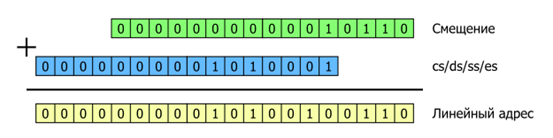
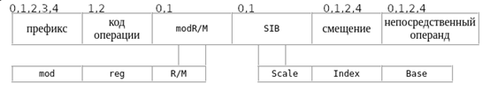
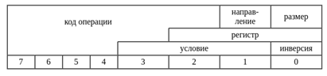

# Лабораторная работа №2

Реальный и защищённый режимы работы процессора X86. Переключение между режимами и сегментная адресация.

## Сокращения

- **BIOS** – Base Input/Output System – базовая система ввода/вывода
- **WSL** – Windows Subsystem for Linux – подсистема Windows для Linux
- **MBR** – Master Boot Record – главная загрузочная запись
- **CHS** – Cylinder-Head-Sector – цилиндр-головка-сектор
- **GPT** – GUID (Globally Unique Identifier) Partition Table – таблица разделов глобальных уникальных идентификаторов
- **LBA** – Logical Block Addressing – логическая блочная адресация
- **AT&T** – American Telephone and Telegraph
- **GDT** – Global Descriptor Table – глобальная таблица дескрипторов
- **LDT** – Local Descriptor Table – локальная таблица дескрипторов
- **GDTR** – Global Descriptor Table Register – регистр глобальной таблицы дескрипторов

## Цель работы

Целью данной лабораторной работы является изучение механизма сегментной адресации памяти в реальном и защищённом режимах работы процессора X86, структуры дескрипторов памяти и дескрипторных таблиц, практическая реализация перехода между реальным и защищённым режимами, а также изучение архитектуры машинных команд.

В процессе выполнения работы студенты:

- Познакомятся со структурой дескрипторов сегментов памяти
- Узнают о преимуществах и ограничениях каждого режима, а также когда и почему используется тот или иной режим
- Начнут понимать принцип кодирования и форматы машинных команд

## Необходимые инструменты

- Любой дистрибутив GNU/Linux: рекомендуется Ubuntu, также можно использовать виртуальную машину, например, WSL
- Ассемблер: `as`
- Компоновщик: `ld`
- Утилиты для анализа объектных файлов: `objdump`, `readelf`
- Препроцессор: `cpp`
- Утилита для работы с дисками: `dd`
- Отладчик: `gdb`
- Утилита для автоматизации сборки проектов: `make`
- Эмулятор: `qemu`

## Исходные файлы лабораторной работы

Файлы, которые используются в лабораторной работе:

- **linker.ld** - скрипт линковщика
- **Makefile** - необходимый для автоматизированной сборки проекта
- **lab2.S** - содержит программу для подготовки и перехода из реального режима в защищённый и обратно

## Материалы для подготовки к лабораторной работе

### Реальный режим работы процессора X86

Режим реальных адресов - это модель памяти, которая поддерживается для обеспечения совместимости с программами, написанными для работы на процессоре X86.

Память разделена на блоки (сегменты) которые могут иметь размер от 16 Байт до 64 КБ. Каждый блок должен начинаться на 16-байтной границе (она называется параграфом), т.е. сегмент может начинаться только по адресу 0, 16, 32, 48 и т.д. В режиме реальных адресов объём памяти составляет 1 МБ (это адреса в диапазоне от 00000h до FFFFFh), чтобы использовать память выше 1МБ (HiMemory), нужно включить линию А20, которая позволяет адресовать больше памяти.

Чтобы получить доступ к памяти, процессор использует два числа: сегмент и смещение. Каждый раз перед тем как процессор обратится к памяти по адресу указанному в паре сегмент:смещение, он вычисляет адрес памяти по следующей схеме:

```
Физический адрес = Сегмент × 16 + Смещение
```

**Примечание!** Умножение на 16 соответствует сдвигу влево на 4 разряда.

**Формирование адреса в реальном режиме:**



В этом режиме не доступны основные достоинства процессора - виртуальная память, мультизадачность, уровни привилегий и другие технологии.

Подробнее о реальном режиме можно почитать здесь: https://www.intel.com/content/www/us/en/developer/articles/technical/intel-sdm.html

### Защищённый режим работы процессора X86

Защищённый режим - это основной режим работы процессора. При работе в защищённом режиме процессор контролирует практически все действия программ и позволяет разделить операционную систему, драйвера и прикладные программы разными уровнями привилегий. В защищённом режиме максимально доступны все ресурсы процессора.

В этом режиме процессор следит за правильным выполнением текущей программой ряда условий, например, программа не должна обращаться по определённым адресам портов ввода/вывода, запрещённых для неё. Если всё же происходит нарушение, процессор генерирует специальный тип прерывания, так называемое исключение, передаёт информацию описывающую где произошло нарушение и как оно произошло обработчику исключения. Далее специальная процедура обрабатывает это прерывание и решает, что сделать с программой, например, прекратить её выполнение.

**Оптимальная схема работы программ по уровням привилегий:**

- Уровень 0: ядро операционной системы
- Уровень 1: драйвера ОС
- Уровень 2: интерфейс ОС
- Уровень 3: прикладные программы

Уровень привилегий 1, 2, и 3 подчиняются условиям, установленным на уровне 0.

В защищённом режиме процессора X86 в сегментных регистрах хранятся селекторы дескрипторов, которые являются индексами в таблицах дескрипторов GDT (глобальной таблице дескрипторов) или LDT (локальной таблице дескрипторов). Эти селекторы указывают на конкретные дескрипторы, содержащие полную информацию о сегменте, включая базовый адрес, предел, права доступа и другие атрибуты соответствующего сегмента памяти.


Подробнее о защищённом режиме можно почитать:
- https://www.intel.com/content/www/us/en/developer/articles/technical/intel-sdm.html
- https://www.sasm.narod.ru/docs/pm/pm_in/main.htm

### Структура и организация дескрипторов и селекторов памяти. Дескрипторные таблицы

При адресации памяти в защищённом режиме команды ссылаются на сегменты, указывая не их адреса (как в режиме реальных адресов), а описания сегментов (их дескрипторы). Указатель на описание сегмента, т. е. на дескриптор называется селектор. Другими словами, селектор - это номер дескриптора в таблице и указатель в какой таблице он размещен, или в глобальной, или в локальной.

Селектор представляет собой 16-битное значение и имеет следующую структуру:


- **Index** - это номер дескриптора в таблице, от 0 до 8191
- **TI** - определяет таблицу, из которой выбирается нужный дескриптор. Если бит установлен в 0, то обращение производится к глобальной таблице дескрипторов, а если в 1, то к текущей локальной дескрипторной таблице
- **RPL** - двухбитовое поле, которое содержит запрашиваемый уровень привилегий

Чтобы программа могла использовать сегмент, его селектор должен быть загружен в один из сегментных регистров. Процессор предоставляет 6 таких регистров. Каждый из этих сегментных регистров поддерживает определённый тип обращения к памяти (код, стек или данные). Для выполнения практически любой программы как минимум понадобятся регистры сегмента кода (CS), сегмента данных (DS) и сегмента стека (SS) и, следовательно, они должны быть загружены. Остальные три дополнительных регистра сегмента данных (ES, FS и GS) могут использоваться для предоставления дополнительных сегментов данных текущей выполняемой программе. Таким образом, хотя система может определять тысячи сегментов, только 6 из них могут быть доступны для немедленного использования. Другие сегменты могут стать доступными путём загрузки их селекторов в эти регистры, но только уже во время выполнения программы.

**Дескриптор сегмента** - это структура данных в GDT (глобальной таблице дескрипторов) или LDT (локальной таблице дескрипторов), которая предоставляет процессору информацию о размере и местоположении сегмента, а также другие данные.

Структура дескриптора представляет собой:


- **Адрес сегмента или базовый адрес** - определяет расположение сегмента в линейном адресном пространстве объёмом 4 ГБ. Процессор объединяет три поля базового адреса в одно 32-битное значение. Другими словами, по этому адресу размещается байт сегмента со смещением ноль.
- **Предел сегмента** - указывает размер сегмента. Процессор объединяет два поля предела сегмента, чтобы получить 20-битное значение. Интерпретация предела сегмента зависит от состояния флага G.
  - Если флаг гранулярности сброшен, размер сегмента указывается в байтах. Он может варьироваться от 1 байта до 1МБ, с шагом в 1 байт.
  - Если флаг гранулярности установлен, размер сегмента указывается в страницах. Он может варьироваться от одной страницы (4 КБ) до 4 ГБ, с шагом в 4 КБ. То есть один сегмент может включать всё адресное пространство ПК.
- **Флаг G** - гранулярность. Если 0, то предел сегмента определяется в байтах, иначе если 1, то в 4 КБ страницах. (Этот флаг не влияет на гранулярность базового адреса - она всегда в байтах)
- **Поле DPL** - указывает уровень привилегий дескрипторов. Другими словами, уровень привилегий объекта, описываемого дескриптором. От 0 до 3, где 0 - это самый привилегированный уровень
- **Поле S** - указывает, является ли дескриптор системным (1 = дескриптор не системный).

**Тип сегмента** - трёхбитовое поле, где каждый бит типа сегмента имеет следующие значения:

- Старший бит (3-ий): если 0, то это сегмент данных, если 1 - то кода
- Средний бит (2-ой) W (write-enable): если 0, то запись запрещена, если 1 - то разрешена
- Младший бит (1-ый) E (expansion-description): направление расширения сегмента если 0, то вверх (в сторону старших адресов) - как обычно, если 1, то вниз (в сторону младших адресов) - как в стеке
- 0-й бит поля type — бит A в зависимости от поля S означает было ли обращение к сегменту(в случае S=1) или выступает как дополнительный бит в описании типа сегмента(в случае S=1)

Для сегментов кода значения битов W и E интерпретируются несколько иначе.

| Биты | 11 | 10(E) | 9(W) | Описание |
|------|----|----|----|----------|
| **данные** | 0 | 0 | 0 | Сегмент данных только для чтения |
| | 0 | 0 | 1 | Сегмент данных для чтения/записи |
| | 0 | 1 | 0 | Сегмент данных только для чтения, растёт вниз |
| | 0 | 1 | 1 | Сегмент данных для чтения/записи, растёт вниз |
| **код** | 1 | 0 | 0 | Сегмент кода только для выполнения |
| | 1 | 0 | 1 | Сегмент кода для выполнения/чтения |
| | 1 | 1 | 0 | Согласованный сегмент кода только для выполнения |
| | 1 | 1 | 1 | Согласованный сегмент кода для выполнения/чтения |

**Поле P** - присутствие сегмента в памяти. Если этот бит установлен, то сегмент есть в памяти, если сброшен, то его нет. Этот бит применяется при реализации механизма виртуальной памяти - если программе понадобится память, то она сохранит содержимое какого-либо сегмента на диск и сбросит бит P. Если любая программа в дальнейшем обратится к этому сегменту, то процессор сгенерирует исключение неприсутствующего сегмента и запустит обработчик этой ситуации, который должен будет подгрузить содержимое сегмента с диска и установить бит P. После этого управление снова передаётся команде, обратившейся к этому сегменту (производится повторное выполнение команды, вызвавшей сбой) и работа программы будет продолжена. Бит P устанавливается и сбрасывается программами, сам процессор его только считывает

**Поле D** - размер операндов по умолчанию.
- Если бит сброшен, по процессор использует объект, описываемый данным дескриптором, как 16-разрядный
- Если бит установлен - то как 32-разрядный.

Если ваша программа имеет 32-разрядный код, то он должен размещаться в 32-разрядном сегменте кода (т.е. в дескрипторе такого сегмента бит D должен быть равен 1).

Каждая система должна иметь одну определённую GDT (глобальную таблицу дескрипторов), которая может использоваться для всех программ в системе. Дополнительно могут быть определены одна или несколько LDT (локальных таблиц дескрипторов). Например, LDT может быть определена для каждой отдельной задачи, выполняемой в системе, или несколько программ могут совместно использовать одну и ту же LDT.

GDT не является сегментом, она представляет структуру данных в линейном адресном пространстве. Базовый линейный адрес и граница GDT должны быть загружены в регистр GDTR. Поскольку дескрипторы сегментов всегда имеют длину 8 байт, граница GDT всегда должна быть на единицу меньше числа, кратного 8 (т.е. 8N - 1).

Первый дескриптор в GDT не используется процессором, селектор сегмента, указывающий на "нулевой дескриптор" всегда вызывает исключение общей защиты.

LDT (локальная дескрипторная таблица) располагается в системном(бит S=0) сегменте типа LDT. GDT должна содержать дескриптор сегмента для этого сегмента LDT. Если система поддерживает несколько LDT, каждая из таблиц должна иметь отдельный селектор сегмента и дескриптор в GDT.

Глобальная и локальная дескрипторные таблицы:


Подробнее можно почитать: https://www.intel.com/content/www/us/en/developer/articles/technical/intel-sdm.html PROTECTED-MODE MEMORY MANAGEMENT

### Разбор машинных команд

Машинная команда - это инструкция, которую выполняет процессор. Каждая машинная команда может содержать от одного байта до 15 байт.

**Структура машинной команды:**



```
[Префиксы] [Код операции] [modR/M] [SIB] [Смещение] [Непосредственный операнд]
```

Кроме поля кода операции все остальные поля являются необязательными, т.е. в одних командах могут присутствовать, а в других нет.

**Префиксы делятся на 4 группы:**

**Блокировки и повторения:**
- `0xF0h` - LOCK префикс
- `0xF2h` - REPNZ (только для строковых инструкций)
- `0xF3h` - REP (только для строковых инструкций)

**Переопределения сегмента:**
- `0x2Eh` - CS:
- `0x36h` - SS:
- `0x3Eh` - DS:
- `0x26h` - ES:
- `0x64h` - FS:
- `0x65h` - GS:

**Переопределения размеров операндов:**
- `0x66h`

**Переопределение размеров адреса:**
- `0x67h`

**Код операции** чаще всего имеет следующую структуру:



Поле кода операции занимает 8 бит.

- Поле размера указывает на размер операндов
  - 0 - операнды имеют размер 1 Байт
  - 1 - операнды имеют размер в слово (двойное слово в 32-битном режиме или 16-битном режиме с префиксом 0x66)
- Поле направления обозначает, какой из операндов будет приёмником
  - 0 - приёмник правый операнд
  - 1 - приёмник левый операнд

**Байт modR/M:**


- Поле reg задаёт регистр общего назначения
- Поле r/m задаёт либо регистр, либо память
- Действует совместно с полем mod
- Даёт возможность указать 8 регистров и 24 варианта для задания формы и режима адресации памяти

Если mod содержит 11b, то два следующих поля будут представлять собой регистры. Но по байту modR/M нельзя точно установить регистры, в зависимости от кода операции и префиксов размера операндов, результат может коренным образом измениться.

**Байт SIB:**

Возможен в команде только в 32-битном режиме, и только в том случает, когда в команде уже есть байт MRM.

Байт SIB позволяет применять ещё более сложные формы для задания адреса в памяти.

Подробнее о сокращённой форме можно прочитать: https://looch-disasm.narod.ru/refe09.htm

Пример №1 разбора команды:


Пример №2 разбора команды:


Пример №3 разбора команды:


Преобразуем машинный код EA 36 00 08 00 в инструкцию:

1. Зайдём на сайт: https://looch-disasm.narod.ru/refe09.htm
2. Открываем вкладку "Первый байт кода операции", находим EA в таблице


3. Переходим по ссылке "Переход и процедуры". Определяем команду


Ниже на этом сайте сказано, что в варианте 3 (который нам нужен) выполняется дальний FAR переход. В 16-битном режиме полный указатель (ptr16:16) занимает четыре байта. 16 бит для смещения и 16 бит для сегмента кода.

Т.е. команда выполняет дальний переход по адресу 0008:0036. Вы можете самостоятельно определить физический адрес с помощью формулы указанной в разделе "Реальный режим работы процессора X86".

## Вопросы для самоконтроля

1. Что такое реальный режим работы процессора X86?
2. Что такое защищённый режим? Какие преимущества он представляет по сравнению с реальным режимом?
3. Что такое дескриптор сегмента? Какие поля он содержит и для чего они используются?
4. Что такое GDT и LDT? В чём их отличия?
5. Как процессор переключается между реальным и защищённым режимами?
6. Что такое селектор? Как он связан с дескриптором?
7. Какие уровни привилегий существуют и как они распределяются?
8. Что такое машинная команды? Какие префиксы могут использоваться в машинных командах X86?

## Выполнение лабораторной работы

### Часть 1. Подготовка к выполнению лабораторной работы

1. Создайте файлы `lab2.S`, `linker.ld` и `Makefile`. Скопируйте код предоставленный в приложении
2. Соберите программу, используя `make` и запустите её с помощью команды `qemu-system-i386 -hda boot.img -m 32`. Как работать с make подробно рассказывается в Лабораторной работе №1.
3. Наблюдайте постепенный вывод таблицы ASCII, а затем сообщение о возврате в реальный режим
4. Замените выводимый при переходе в реальный режим текст (метка `.mesg`) на "ФИО вернулся в реальный режим" и запустите программу, чтобы убедиться в её нормальной работе

### Часть 2. Анализ программы

#### 2.1. Запуск с отладкой

Запустите эмулятор с поддержкой отладки, затем в отладчике перейдите к инструкции по адресу 0x7C3A

#### 2.2. Анализ регистров

Выведите все регистры, обратите своё внимание на регистр cr0, проанализируйте значения сегментных регистров

#### 2.3. Вывод таблицы дескрипторов

Выведите всю таблицу дескрипторов: `x/20x адрес GDT`, адрес GDT определите сами используя команду `readelf -a lab2.elf`

#### 2.4. Сравнение дескрипторов

Сравните дескрипторы хранящиеся в памяти, с дескрипторами описанными в коде программы, проверьте их правильность (например, верно ли записан предел)

### Часть 3. Выполнение действий в защищённом режиме

#### 3.1. Тест с несуществующим селектором

В программе после перехода в защищённый режим запишите в сегментный регистр GS селектор 0x30 и попробуйте запустить получившуюся программу. Наблюдайте неработоспособность программы. Объясните причину

#### 3.2. Тест с неправильным селектором

Отредактируйте программу так, чтобы в сегментный регистр данных был записан селектор сегмента кода. Наблюдайте неправильную работу программы. Объясните причину и исправьте программу, чтобы процессор сбрасывался при попытке чтения из сегмента кода

#### 3.3. Создание алиаса

Создайте новый дескриптор, который будет дублировать дескриптор сегмента кода (алиас), но будет иметь возможность чтения/записи. Запишите селектор этого алиас в сегментный регистр GS и запишите какое-нибудь число в начало сегмента кода. Проверьте работоспособность программы. В режиме отладки проверьте, действительно ли число было записано в начало сегмента кода

#### 3.4. Тест с правами только на чтение

Поменяйте права алиаса на только чтение, попробуйте запустить полученную программу, однако эмулятору добавьте ключ `-enable-kvm`, который позволит использовать аппаратную виртуализацию процессора, также попробуйте без данного ключа.

#### 3.5. Перестановка дескрипторов

Поменяйте местами 2 дескриптора, исправьте программу, чтобы она сохранила работоспособность.

## Защита лабораторной работы

1. Выберите любую машинную команду из лабораторной работы №2 и разберите её
2. Объясните назначение и использование макроса descr в коде программы. Какие параметры дескриптора задаются через этот макрос?
3. Почему в GDT используются сегменты с разными правами доступа (EXEC_READ, READ_WRITE)? Как это влияет на выполнение программы?
4. Как происходит переключение процессора в защищённый режим? Расскажите, какие команды для этого используются в коде.
5. В коде используется переход `ljmp $0x8, $CS_OFF(goto_64k_segment)`. Объясните, почему именно эта команда используется для перехода в реальный режим. Что произойдёт, если её заменить на jmp?
6. Как добавлять новые дескрипторы в таблицу дескрипторов?
7. Какие ошибки могут возникнуть при загрузке селектора в сегментный регистр?

## Приложение

### Makefile

```makefile
all: lab2.bin
	dd if=lab2.bin of=boot.img # Записываем программу в disk.img
lab2.o: lab2.S
	cpp -o lab2.s lab2.S # Разворачиваем макрорасширения
	as --32 -o lab2.o lab2.s # Компилируем программу для архитектуры x86
lab2.bin: lab2.o
	ld -m elf_i386 -T linker.ld --gc-sections -o lab2.elf lab2.o # Связываем объектный файл lab2.o с использованием скрипта линкера linker.ld, создавая ELF-файл lab2.elf. Флаг --gc-sections удаляет неиспользуемые секции для оптимизации.
	objcopy -S -O binary lab2.elf lab2.bin # Конвертируем ELF-файл lab2.elf в чистый бинарный файл lab2.bin. Флаг -S исключает символы и отладочную информацию, а -O binary указывает формат вывода.
clean:
	rm *.o *.elf *.bin *.s *.img #Удаляем всё лишнее
```

### linker.ld

```ld
/* Указываем точку входа в программу. В данном случае это функция _start. */
ENTRY(_start)

/* Определяем секции и их расположение в памяти. */
SECTIONS {
    /* Устанавливаем текущий адрес (счетчик местоположения) на 0x7C00.
       Это стандартный адрес, по которому BIOS загружает загрузочный сектор. */
    . = 0x7C00;

    /* Секция .text: содержит исполняемый код программы. */
    .text : {
        *(.text) /* Включаем все объектные файлы, которые содержат секцию .text. */
    }

    /* Секция .data: содержит инициализированные данные программы. */
    .data : {
        *(.data) /* Включаем все объектные файлы, которые содержат секцию .data. */
    }

    /* Секция .stack: выделяет память для стека программы. */
    .stack : {
        *(.stack) /* Включаем все объектные файлы, которые содержат секцию .stack. */
    }

    /* Секция /DISCARD/: указывает компоновщику отбросить ненужные секции.
       Это помогает уменьшить размер итогового бинарного файла. */
    /DISCARD/ : {
        *(.note*)  /* Отбрасываем все секции, начинающиеся с .note (например, отладочные метаданные). */
        *(.comment) /* Отбрасываем секции с комментариями. */
        *(.gnu*)   /* Отбрасываем все секции, начинающиеся с .gnu (например, специфичные для GNU атрибуты). */
    }

    /* Перемещаем текущий адрес на 0x7DFE. Это предпоследний байт загрузочного сектора. */
    . = 0x7DFE;

    /* Секция .sig: добавляет сигнатуру загрузочного сектора.
       BIOS проверяет эту сигнатуру, чтобы убедиться, что сектор является загрузочным. */
    .sig : AT(0x7DFE) /* Указываем, что эта секция должна быть расположена по адресу 0x7DFE. */
    {
        SHORT(0xAA55) /* Записываем два байта: 0x55 и 0xAA (в обратном порядке из-за little-endian). */
    }
}
```

### lab2.S

```asm
#define EXEC_ONLY 0x8                     // сегмент кода, только исполнение
#define EXEC_READ 0xA                     // сегмент кода, исполнение и чтение
#define READ_ONLY 0x0                     // сегмент данных, только чтение
#define READ_WRITE 0x2                    // сегмент данных, чтение и запись
#define G_BYTE 0x0                        // байтовая гранулярность
#define G_PAGE 0x80                       // страничная гранулярность
#define SEG_16 0x0                        // 16-разрядный сегмент
#define SEG_32 0x40                       // 32-разрядный сегмент

#define STACK_SIZE 0x10                   // размер стека
/*
   Макроопределение в С-стиле. Создает дескриптор с заданными параметрами
   base, limit, type, attr. Для задания типа и атрибутов использовать макроопределения выше.
*/
#define descr(base, limit, type, attr) \
  .word (limit & 0xFFFF); \
  .word (base & 0xFFFF); \
  .byte ((base >> 16) & 0xFF); \
  .byte (0x90 | (type)); \ // поля P и S – присутутствует в ОП, не является системным сегментов
  .byte (attr | ((limit >> 16) & 0xF)); \ // записываем 4 старших разряда из предела сегмента и attr
  .byte ((base >> 24) & 0xFF) // старшие 8 байтов базы сегмента

/**********************************************************************************
  Компоновщик GNU ld умеет работать только с моделью памяи FLAT.
  Для прямой адресации использовать следующие макросы.
*/
#define CS_OFF(label) (label - _start) // смещение относительно начала сегмента кода
#define DS_OFF(label) (label - .data) // смещение относительно начала сегмента данных

/**********************************************************************************
  Процессор загружает первый сектор диска (512 байт) по адресу 0x0:0x7C00
  и передает на него управление: ip = 0x7C00.
  Процессор находится в реальном режиме.

  Значения сегментных регистров: перед выполнением кода
  cs = 0x0    ds = 0x0    es = 0x0
  ss = 0x0    fs = 0x0    gs = 0x0
*/

/******************** Начало секции Кода *******************/
.text
.code16                                 // указание ассемблеру генерировать 16-разрядный код


.global _start
_start:
  movw $0x3, %ax                        // очистка экрана: задаем режим видеоадаптера (80x25, 16-цветный)
  int $0x10                             // используем 0x10 прерывание BIOS (ah = 0, al = 3)
  movw $.data, %ax
  movw $seg_data, %bx                   // записываем базовый адрес семента данных в соответствующий дескриптор
  movw %ax, 2(%bx)
  movw $.stack, %ax                     // записываем базовый адрес сегмента стека в соответствующий дескриптор
  movw $seg_stack, %bx
  movw %ax, 2(%bx)                      // (для кода и видеобуфера базовые адреса известны)
  cli                                   // запрещаем аппаратные прерывания
  movb $0x80, %al
  outb %al, $0x70                       // запрещаем NMI (немаскируемые прерывания)
  inb $0x92, %al                        // включаем А20 адресную линию
  orb $0x2, %al
  outb %al, $0x92
  lgdt gdtdesc                          // загружаем значение GDTR
  movl %cr0, %eax
  orl $1, %eax
  movl %eax, %cr0                       // устанавливаем бит PE в регистре CR0 
                                        //  Эти инструкции должны выполняться   непосредственно друг за другом
  ljmp $0x8, $CS_OFF(goto_prot)         // переходим в новый сегмент кода (cs, ip) 
/**********************************************************************************
  Теперь процессор работает в защищенном режиме
*/
.code32                                 // указание компилятору генерировать 32-разрядный код
goto_prot:
  movw $0x10, %ax
  movw %ax, %ds                         // загружаем новый селектор сегмента данных
  movw $0x18, %ax
  movw %ax, %ss				// загружаем новый селектор сегмента стека
  movl $STACK_SIZE, %esp		// устанавливаем указатель стека на значение "дна" стека
  movw $0x20, %ax
  movw %ax, %es				// загружаем селектор сегмента видеобуфера

# Обращение за пределы GDT
#	movw $0x30, %ax
#	movw %ax, %gs

# Селектор сегмента кода в сегмент данных
#	movw $0x8, %ax
#	movw %ax, %ds

/* Протестируем запись символов ascii в видеопамять */

  movl $320, %ebx			// начальное смещение на экране
  movl $110, %ecx			// число выводимых символов
  movw %ds:DS_OFF(symbol), %ax		// загружаем начальный символ с атрибутом (обращение к сегменту данных!)
print_pm:
  movw %ax, %es:(%ebx)			// записываем очередной символ в видеопамять (обращение к сегменту видеопамяти!)
  addl $2, %ebx				// смещаемся в видеобуфере
  incw %ax				// код следующего символа
  pushl %ecx				// сохраняем ecx в стеке (обращение к сегменту стека!)
  movl $0xFFFFFF, %ecx			// добавим паузу для наглядности
idle:
  nop
  loop idle				// цикл паузы
  popl %ecx				// возвращаем ecx из стека
  loop print_pm				// цикл вывода на экран


stop:
jmp stop

/* Подготовим переход в реальный режим. Сперва надо сформировать дескрипторы для реального режима.
   Для этого модифицируем соответствующие дескрипторы в GDT
*/
  movw $0xFFFF, %ds:DS_OFF(seg_text)		// требуется сегмент кода с лимитом 64k
  movb $0, %ds:DS_OFF(seg_text) + 6 // обнуляем старшую часть предела
  orb $EXEC_READ, %ds:DS_OFF(seg_text) + 5	// и доступный для чтения

						// Для остальных сегментов требования следующие
  movw $0xFFFF, %ds:DS_OFF(seg_data)		// 	Limit = 64k (0xFFFF)
  movb $0, %ds:DS_OFF(seg_data) + 6		// 	Byte granularity (G = 0)
  orb $READ_WRITE, %ds:DS_OFF(seg_data) + 5	// 	Expand up (E = 0)
						// 	Writable (W = 1)
  movw $0xFFFF, %ds:DS_OFF(seg_stack)		// 	Present (P = 1)
  movb $0, %ds:DS_OFF(seg_stack) + 6
  orb $READ_WRITE, %ds:DS_OFF(seg_stack) + 5

  movw $0xFFFF, %ds:DS_OFF(seg_videomem)
  movb $0, %ds:DS_OFF(seg_videomem) + 6
  orb $READ_WRITE, %ds:DS_OFF(seg_videomem) + 5

  movw $0x10, %ax			// загрузим теневые регистры сегментов, т. к. изменились сами дескрипторы
  movw %ax, %ds
  movw $0x18, %ax
  movw %ax, %ss
  movw $0x20, %ax
  movw %ax, %es

  ljmp $0x8, $CS_OFF(goto_64k_segment)	// выполним дальний переход, чтобы снова загрузить селектор
					// в CS и модифицировать его теневой регистр

goto_64k_segment:

  .code16				// снова генерируем 16-разрядный код
  movl %cr0, %eax
  andl $0xFFFFFFFE, %eax
  movl %eax, %cr0			// сбросим бит PE в регистре CR0

  ljmp $0x7C00, $CS_OFF(goto_real)	// переходим в реальный режим

/*---------------------------------------------------------------------------------
 	Теперь процессор снова работает в реальном режиме
*/

goto_real:
  movw $.data, %ax			// возвращаем значения сегментных регистров реального режима
  shrw $4, %ax
  movw %ax, %ds
  movw %ax, %es
  movw $.stack, %ax
  shrw $4, %ax
  movw %ax, %ss

  sti					// разрешим аппаратные и немаскируемые прерывания
  movb $0, %al
  outb %al, $0x70

/* Проверяем работоспособность сервиса BIOS */

  movb $0x0E, %ah			// вывод символа в режиме телетайпа (атрибут текущий):
  xorw %bx, %bx				// 0-ая страница видеопамяти

  movw $DS_OFF(mesg), %si		// смещение строки символов в регистр si

print_rm:
  movb (%si), %al
  cmpb $0, %al				// пока не встретился '\0'
  je hang
  inc %si
  int $0x10				// выводим символы строки на экран
  loop print_rm

hang:
  jmp hang				// зацикливание

text_size = . - _start 			// размер секции кода

/********************** Начало секции Данных ***********************/
.data

/*---------------------------------------------------------------------------------
 	Глобальная таблица дескрипторов
*/
.align 16								// процессор быстрее обращается с выровненной таблицей
GDT:
seg_null: .quad 0							// нулевой дескриптор - 8 байт
seg_text: descr (0x7C00, (text_size - 1), EXEC_READ, G_BYTE | SEG_32)	// дескриптор сегмента кода 	(селектор 0x8)
seg_data: descr (0, (data_size - 1), READ_WRITE, G_BYTE | SEG_32)	// дескриптор сегмента данных	(селектор 0x10)
seg_stack: descr (0, (stack_size - 1), READ_WRITE, G_BYTE | SEG_32)	// дескриптор сегмента стека	(селектор 0x18)
seg_videomem: descr (0xB8000, 0xFFF, READ_WRITE, G_BYTE | SEG_32)	// дескриптор видеобуфера	(селектор 0x20)
GDT_size = . - GDT

/*-------------------------------------------------------------------------------*/

gdtdesc:  .word GDT_size - 1		// предел GDT 2 байта
         .long GDT			// базовый адрес GDT 4 байта

symbol:   .byte 1			// начальный код символа для вывода на экран в защищенном режиме
sym_attr: .byte 0x1e			// атрибут символа

mesg:     .asciz "Back to real mode!!!"	// сообщение при возращении в реальный режим

data_size = . - .data			// размер секции данных

/************************* Секция Стека ***********************/

.section .stack, "wa" //  w  – разрешена запись, а-  разрешено динамическое  выделение памяти

.align 16

.space STACK_SIZE, '^'			// выделим место под стек и заполним его символом '^'

stack_size = . - .stack			// размер секции стека
```

