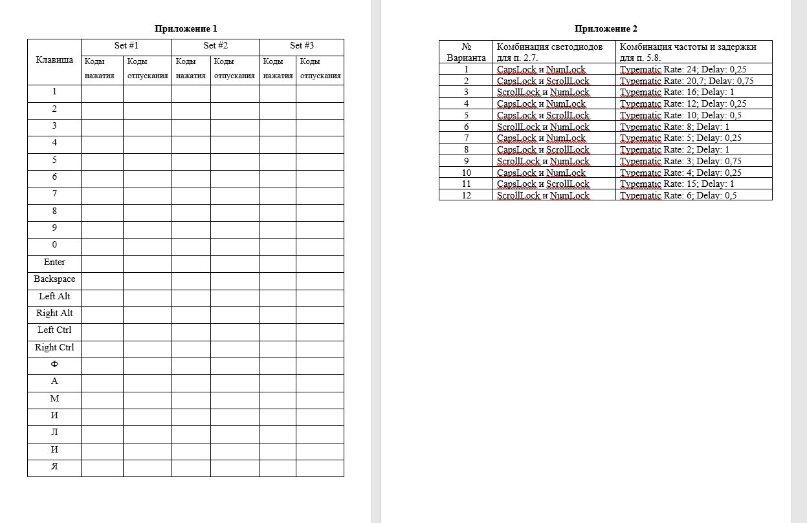

# Мышь PS/2

## Подключение манипулятора к процессорной системе DE 2-115 Media Computer с использованием интерфейса PS/2

**Цель работы:** Изучение принципа работы манипулятора типа мышь, и его драйверов.

## Задание на выполнение работы

### Подготовленные для выполнения работы программные заготовки

**Заготовка 1.** Вначале все индикаторы (ledg, hex) должны быть погашены. Программа считывает слово из порта ввода вывода, анализирует поле VALID. Если оно не равно нулю, то считанное слово действительно. В этом случае программа выводит содержимое поля RAVAL на зеленые светодиоды, с учетом уже считанного слова, извлекает из буфера FIFO содержащиеся там байты и отображает на HEX индикаторах справа налево. На Hex индикаторах можно отобразить только первые 4 байта из буфера. В качестве параметра используется адрес порта ввода вывода. Сначала выполняем манипуляции с мышью или клавиатурой, затем запускаем программу. После того, как программа считает все содержимое буфера, она завершает свое выполнение.

**Заготовка 2.** Программа считывает слово из порта ввода вывода, анализирует поле VALID, если оно не равно нулю, то это значит данные в буфере FIFO действительны, и в этом случае программа пересылает младший байт считанного слова в ячейку ОП, начиная с заданного адреса. Если данных в буфере FIFO нет, программа ожидает их поступления. Программа работает непрерывно. Для её завершения используется команда Stop из меню Аction приложения АМР. В качестве параметров используются адреса порта вв/выв и ОП. Предполагается, что после завершения программы во вкладке memory можно просмотреть содержимое ОП, используя побайтовое отображение.

**Заготовка 2.1** Программа отличается от предыдущей тем, что разбирает считанные из буфера FIFO пакеты и отправляет их в ОП таким образом, чтобы потом во вкладке memory удобно было выполнить анализ последовательности из первых байт пакета (состояние кнопок мыши), вторых байт пакета (перемещение Х), третьих байтов пакета (перемещение У).

**Заготовка 3.** В программе выполняется программирование таймера для одноразового измерения интервала времени продолжительностью N секунд (N это параметр) и разрешается прерывание от таймера по завершению заданного интервала. Затем она анализирует наличие пакетов в буфере FIFO, переданных мышью. После обнаружения факта передачи пакетов от мыши, программа запускает таймер и непрерывно считывает передаваемые мышью пакеты и сохраняет их в ОП. После завершения заданного временного интервала обработчик прерывания определяет частоту дискретизации мыши поделив общее число принятых пакетов на длительность интервала и отображает вычисленное значение на красных светодиодах стенда. Вначале светодиоды должны быть погашены. Используя эту программу, можно экспериментально определить задаваемый временной параметр работы мыши. В качестве пунктов задания можно определить этот параметр, установленный по умолчанию, минимальное значение, максимальное значение. Рекомендуется использовать прямолинейную траекторию. После завершения работы программы можно исследовать переданные пакеты во вкладке memory и восстановить траекторию движения мыши. Можно предложить изменить скорость перемещения мыши от минимальной до максимально возможной и повторить выполнение программы.

Можно предложить в качестве индивидуальных вариантов траектории в виде квадрата с заданной стороной, треугольника с заданными сторонами, прямоугольника, трапеции. Можно использовать нажатие кнопок в вершинах фигуры. Студенты должны обнаружить этот факт во время анализа переданных пакетов.

## 1 часть. Режимы работы мыши и команды управления манипулятором

Для выполнения пунктов задания этой части рекомендуется использовать заготовку 1. Программа определяет есть ли информация в буфере FIFO, переданная PS2 устройством, и если она там есть, то программа извлекает её из буфера и отображает, например, на HEX индикаторах стенда.

1. Используя вкладку Memory приложения АМР, отправьте команду Reset 0xFF в порт данных мыши. Наблюдайте ответное сообщение со стороны мыши. Осмыслите переданную устройством информацию и отобразите в отчете ваше объяснение.

2. Экспериментально определите, будет ли устройство отправлять пакеты данных, если нажать одну из кнопок, левую, среднюю, правую?

3. Попробуйте переместить мышь в любом направлении. Проверьте, происходит ли пересылка данных от мыши в процессорную систему. Если да, осмыслите передаваемую устройством информацию. Если нет, попробуйте объяснить причину.

4. Используя вкладку Memory приложения АМР, отправьте команду Enable Data Reporting (0xF4) в порт данных мыши.

5. Повторите выполнение пунктов 1.2. и 1.3. Отразите в отчете произошедшие изменения.

6. Переключите мышь в удаленный режим работы (Remote). Для этого отправьте в порт данных мыши соответствующую команду Set Remote Mode (0xF0). Проверьте будет ли мышь пересылать пакеты данных о своих перемещениях, если нажать любую из кнопок или переместить мышь в некотором направлении. Зафиксируйте в отчете ваши наблюдения.

7. Отправьте команду Read Data (0xEB). в порт данных мыши. Еще раз проверьте, будет ли мышь пересылать пакеты данных о своих перемещениях, если нажать любую из кнопок мыши или переместить мышь в произвольном направлении. Если пакеты будут переданы, осмыслите их содержимое и отразите в отчете.

8. Не меняя положения мыши и не нажимая кнопок, еще раз повторите выполнение предыдущего пункта задания. Объясните содержимое переданного устройством пакета.

9. Установите мышь в обратный режим. Для этого отправьте в порт данных мыши команду Reset Wrap Mode (0xEC). Экспериментально определите поведение мыши в этом режиме. Попробуйте нажимать любые кнопки мыши и перемещать её в некотором направлении. Проверьте пересылает ли мышь в этом режиме пакеты данных о своих перемещениях. Отразите в отчете. Попробуйте отправлять мыши произвольные байты данных. Зафиксируйте в отчете, как на это будет реагировать мышь?

10. Проверьте и отразите в отчете реакцию мыши если в качестве передаваемого ей байта использовать команду (0хEC).

11. Проверьте реакцию мыши если отправить ей байт (0хFF). Следует напомнить, что этот байт используется для кодирования команды Reset.

12. Отправьте в порт данных мыши команду Get Device ID (0xF2). Убедитесь, что мышь передает свой идентификационный номер и сбрасывает свои счетчики перемещения. Занесите в отчет идентификационный номер мыши.

13. Отправьте в порт данных мыши команду запроса состояния Status Request (0xE9). Исследуйте передаваемые мышью ответные пакеты данных. Занесите в отчет. Осмыслите содержимое байтов пакета состояния.

## 2 часть. Исследование потокового режима работы мыши и формата пересылаемых пакетов

1. Отправьте в порт данных мыши команду Set Stream Mode (0xEA).

2. С помощью команды Enable Data Reporting (0xF4) разрешите мыши отправлять пакеты о своих перемещениях. Убедитесь, что пакеты пересылаются если нажать любую из кнопок мыши или переместить мышь в произвольном направлении.

3. Экспериментально определите формат пересылаемого пакета. Для этого, не перемещая мышь, нажмите левую кнопку и наблюдайте переданный пакет. Повторите эти действия для средней кнопки и для правой. Затем определите, какой разряд, какого байта пакета отображает состояние нажимаемых кнопок и отразите в отчете.

4. Установите минимальную частоту дискретизации, равную десяти отчетам в секунду. Для этого необходимо отправить команду Set Sample Rate (0хF3) в порт данных мыши. После получения байта подтверждения от мыши, отправьте байт с аргументом команды.

5. Для выполнения последующих пунктов задания рекомендуется в качестве коврика для мыши использовать лист миллиметровки с нанесенными на него координатными осями Х и Y.

6. Установите мышь на коврик таким образом, чтобы она была ориентирована строго вдоль оси У, и чтобы точка соединения мыши с проводом попала в центр координат коврика.

7. Переместите равномерно мышь вправо в горизонтальном направлении (по оси Х на коврике) в течении трех секунд. Определите какое количество отчетов было передано за это время в процессорную систему, анализируя поле RAVAL регистра данных порта мыши. Соответствует ли оно ожидаемому значению? Отразите в отчете. С помощью ранее использованной программы извлеките переданные мышью пакеты из буфера FIFO контроллера и осмыслите содержимое байтов со значениями перемещения Х и Y. Уясните, как формируются эти значения и отразите в отчете. По координатной сетке на коврике определите, на какое расстояние переместилась мышь за это время. Определите разрешающую способность мыши, анализируя переданные мышью пакеты и отразите в отчете.

8. Повторите предыдущий пункт задания, равномерно перемещая мышь влево в течении трех секунд, но теперь уже с большей скоростью. Определите координату конечной точки, куда переместилась мышь по координатной сетке на коврике мыши. Проанализируйте переданные мышью пакеты. Уясните в каком коде формируются отрицательные значения перемещения по оси Х. По содержимому переданных пакетов попробуйте определить координату конечной точки траектории и сравните её с экспериментально определенной.

9. Еще раз установите мышь в начало координат. Повторите пункт 1.16. задания, равномерно перемещая мышь по направлению оси Y (от себя в плоскости стола). Занесите в отчет ваши наблюдения. А если предварительно повернуть мышь по часовой стрелке на угол 45 градусов? Уясните, как мышь воспринимает направления Х и У.

10. Повторите пункт 1.16. задания, равномерно перемещая мышь в противоположном оси Y направлении (к себе в плоскости стола), но уже с большей скоростью. Определите координату конечной точки, куда переместилась мышь по координатной сетке на коврике мыши. Проанализируйте переданные мышью пакеты. Уясните в каком коде формируются отрицательные значения перемещения по оси У. По содержимому переданных пакетов попробуйте определить координату конечной точки траектории и сравните её с экспериментально определенной.

## Часть3. Определение разрешающей способности мыши и её временных характеристик

Для выполнения последующих пунктов задания…

1. Экспериментально определите параметры мыши, устанавливаемые по умолчанию. Для этого повторно установите мышь в потоковый режим, после получения подтверждения отправьте команду запроса состояния мыши Status Request (0xE9). Исследуйте передаваемый мышью ответный пакет данных. Определите её разрешение, частоту опроса и масштабирование. Для расшифровки переданных мышью данных рекомендуется использовать информацию из предварительно изученного теоретического раздела, включенную в отчет при подготовке к лабораторной работе.

2. Выполните перемещение мыши из центра координат вдоль биссектрисы угла первой координатной четверти, используя установленную по умолчанию частоту дискретизации. Экспериментально определите её значение, сопоставив количество переданных мышью пакетов и время перемещения мыши. Если обнаружится, что буфер полностью заполнен, уменьшите время перемещения мыши. Определите максимальный размер буфера FIFO и предельное время его заполнения при работе мыши с такой частотой дискретизации. Проанализируйте содержимое переданных мышью пакетов.

3. Установите частоту дискретизации 20 значений в секунду, отправив в порт данных мыши соответствующую команду.

4. Установите минимальное разрешение, соответствующее одному значению на миллиметр, отправив в порт данных мыши команду Set Resolution (0xE8), наблюдайте ответный байт от мыши, после чего передайте байт с аргументом для этой команды (00).

5. Выполните перемещение мыши в противоположном направлении вдоль биссектрисы угла первой координатной четверти в центр координат. Проанализируйте количество и содержимое переданных за это время пакетов данных. Сопоставьте с ожидаемыми значениями. Отразите в отчете ваше заключение.

6. Установите максимальное разрешение, соответствующее восьми значениям на миллиметр, отправив в порт данных мыши команду Set Resolution (0xE8), наблюдайте ответный байт от мыши, после чего передайте байт с аргументом для этой команды (03).

7. Выполните перемещение мыши в любом направлении. Проанализируйте количество и содержимое переданных за это время пакетов данных. Сопоставьте с ожидаемыми значениями. Отразите в отчете ваше заключение.

## 4 часть. Исследование параметра масштабирования мыши

1. Повторно установите мышь в потоковый режим. Для этого повторите выполнение пункта 1.20 задания. Следует напомнить, что после выполнения этой команды устанавливаются параметры работы мыши, соответствующие настройкам по умолчанию, включая масштабирование 1:1.

2. Установите мышь в центр координат на коврике и ориентируйте вдоль оси У. Переместите мышь с некоторым ускорением по прямой линии в первой четверти в течении 2 секунд. С помощью программной заготовки 3 сохраните передаваемые мышью пакеты о её перемещении в ОП.

3. Установите масштабирование 2 :1, отправив в порт данных мыши команду Set Scaling 2:1 (0хЕ7). Повторите выполнение предыдущего пункта. Сопоставьте переданные мышью данные с наблюдаемыми в предыдущем пункте. Занесите в отчет ваше заключение.

## Отчетные материалы

Отчет должен включать в себя:

1. Цель работы.
2. Краткие сведения из теоретической части.
3. Информацию по выполнению пунктов задания.
4. Краткое заключение.

## Контрольные вопросы

1. Какой режим работы мыши является основным?
2. В чем особенность удаленного режима работы мыши?
3. В чем заключается обратный режим работы мыши?
4. Какие команды работают в обратном режиме?
5. Как разрешить/запретить отправку мышью пакетов?
6. Как экспериментально в лабораторной работе определяется разрешение мыши? Каково его минимальное и максимальное значение?
7. Как экспериментально в лабораторной работе определяется частота дискретизации мыши? Каково её минимальное и максимальное значение?
8. Как инициализируется использование колеса прокрутки в мыши?
9. Как хост может понять, какое устройство к нему подключено?
10. Какой идентификационный номер соответствует обычной мыши?
11. Какой идентификационный номер соответствует мыши с колесом прокрутки?
12. Чем отличаются пакеты, отправляемые мышью с колесом прокрутки?
13. Как отличить пакет состояния мыши от пакета перемещения мыши?

## Литература

1. Ефремов Н. В., Бородин А. А. Инструментальные средства проектирования и отладки цифровых систем на программируемом кристалле фирмы «Altera». Учебное пособие. — М.: ФГБОУ ВПО МГУЛ, 2012. — 151 с.
2. Ввод с помощью мыши. [Электронный ресурс] // OSDev Wiki. URL: https://wiki.osdev.org/Mouse_Input.
3. Контроллер интерфейса PS/2. [Электронный ресурс] // OSDev Wiki. — URL: https://osdev.fandom.com/ru/wiki/%D0%9A%D0%BE%D0%BD%D1%82%D1%80%D0%BE%D0%BB%D0%BB%D0%B5%D1%80_%D0%B8%D0%BD%D1%82%D0%B5%D1%80%D1%84%D0%B5%D0%B9%D1%81%D0%B0_PS/2#%D0%98%D0%BD%D1%82%D0%B5%D1%80%D1%84%D0%B5%D0%B9%D1%81_PS/2.
4. Altera Monitor Program. [Электронный ресурс] // URL: http://www-ug.eecg.toronto.edu/desl/docs/Monitor_tutorial.pdf.

## Приложение 1



## Приложение 2

В зависимости от версии программы Altera Monitor Program могут использоваться другие адреса портов для периферийных устройств. В более ранних версиях используются следующие адреса:

```assembly
.equ LED_R, 0x10000000
.equ PS2_DATA, 0x10000100
.equ TIMER, 0x10002000
.equ JTAG_UART_BASE, 0x10001000
```

### Листинг программы PS2_X_Y_Packets_Rate_to_JTAG_and_LedR


