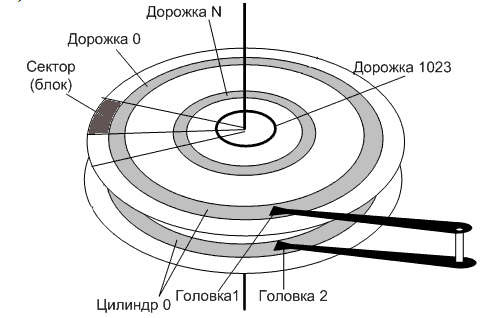

# Лабораторная работа №1

Запуск программы в эмуляторе процессора i386 и её отладка.

## Сокращения

- **BIOS** – Base Input/Output System – базовая система ввода/вывода
- **WSL** – Windows Subsystem for Linux – подсистема Windows для Linux
- **MBR** – Master Boot Record – главная загрузочная запись
- **CHS** – Cylinder-Head-Sector – цилиндр-головка-сектор
- **GPT** – GUID (Globally Unique Identifier) Partition Table – таблица разделов глобальных уникальных идентификаторов
- **LBA** – Logical Block Addressing – логическая блочная адресация
- **AT&T** – American Telephone and Telegraph

## Цель работы

Целью данной лабораторной работы является изучение низкоуровнего взаимодействия программы с аппаратным обеспечением, в частности, с дисковыми накопителями, через функции BIOS (Base Input-Output System)(int 13h).

В процессе выполнения работы студенты:

- Освоят инструменты низкоуровневой разработки
- Научатся создавать и использовать утилиту Makefile для автоматизации сборки проекта
- Овладеют навыками эмуляции работы программы на процессорах архитектуры X86 с помощью эмулятора QEMU

## Необходимые инструменты

- Любой дистрибутив GNU/Linux: рекомендуется Ubuntu, также можно использовать виртуальную машину, например, WSL (Windows Subsystem for Linux)
- Ассемблер: `as`
- Компоновщик: `ld`
- Утилиты для анализа объектных файлов: `objdump`, `readelf`
- Утилита для работы с дисками: `dd`
- Отладчик: `gdb`
- Эмулятор: `qemu`
- Утилиты для автоматизации сборки проектов: `make`

## Исходные файлы лабораторной работы

Файлы, которые используются в первой лабораторной работе:

- **Makefile** - скрипт для автоматизированной сборки проекта
- **disk_device** - образ виртуального диска, имитирующий внешний накопитель для чтения/записи данных
- **linker.ld** - скрипт линковщика
- **lab1.s** - содержит программу на ассемблере, реализующую низкоуровневое взаимодействие с диском через функции BIOS
- **create_disk_device.sh** - bash-скрипт для создания файла образа внешнего диска

## Материалы для подготовки к лабораторной работе

### Блочные устройства внешней памяти

Это аппаратные компоненты, предназначенные для хранения данных, например, жёсткие диски, SSD, CD-ROM и другие накопители. Они обрабатывают данные блоками фиксированного размера.



**Цилиндр** — совокупность всех дорожек в заданном положении головок.

### Загрузочный сектор (MBR - Master Boot Record)

Это первый сектор на диске (512 байт), который используется BIOS для запуска операционной системы. После включения компьютера BIOS выполняет следующие действия:

1. Инициализация оборудования.
2. Считывание первого сектора выбранного загрузочного устройства (жесткого диска, USB, CD/DVD).
3. Загрузка содержимого этого сектора в оперативную память по фиксированному адресу (обычно 0x7C00).
4. Передача управления коду по этому адресу.

Этот процесс работает на архитектуре x86, где процессор после включения питания запускается в режиме реальной адресации (real mode). В этом режиме обращение к памяти осуществляется с использованием двух шестнадцатиразрядных компонентов адреса — первый задает базовый адрес сегмента в ОП, второй смещение внутри сегмента.

**MBR состоит из:**

- Первоначального кода (обычно 446 байт).
- Таблицы разделов (64 байта), которая содержит информацию о структуре разделов на диске.
- Подписи (2 байта, значение 0x55AA), которая сообщает BIOS, что сектор является загрузочным.

Процессоры семейства x86 (например, i386) поддерживают сегментную модель адресации памяти. Это значит, что адрес задается с помощью двух значений:

- **Сегмент**: базовый адрес, указывающий на начало области памяти.
- **Смещение**: относительный адрес внутри сегмента.

Когда BIOS загружает MBR в память, он устанавливает сегментные регистры (например, CS) так, чтобы код MBR был доступен по адресу 0x7C00. После этого выполнение кода продолжается с адреса 0x7C00.

Этот подход позволяет писать минимальные программы, которые будут сразу выполняться, так как BIOS гарантирует правильное размещение и передачу управления.

Подробнее о процессе загрузки MBR можно почитать: https://wiki.osdev.org/MBR

### BIOS

Выполняет ключевую роль в начальной загрузке системы.

**Основные функции BIOS:**

- Проверка оборудования (POST — Power-On Self Test).
- Настройка начального окружения для выполнения программ (установка сегментных регистров, загрузка MBR).
- Обеспечение начального взаимодействия с памятью и устройствами ввода-вывода.

BIOS предоставляет минимальное окружение для выполнения программ, что делает возможным выполнение даже простого машинного кода, записанного в MBR.

QEMU эмулирует поведение реального компьютера, включая BIOS и процессор.

**Функции BIOS int 13h** предоставляют низкоуровневый интерфейс для работы с дисковыми накопителями. Они позволяют читать и записывать данные на диск, а также выполнять другие операции, такие как сброс диска (рекалибровку контроллера диска, в ходе которой головки устанавливаются на нулевую дорожку) и проверка его состояния.

#### Чтение секторов (AH = 02h)

**Параметры:**

- `AH = 02h` - функция чтения
- `AL` - количество секторов для чтения
- `CH` - номер цилиндра
- `CL` - номер сектора
- `DH` - номер головки
- `DL` - номер диска
- `ES:BX` - адрес буфера для данных

#### Запись секторов (AH = 03h)

**Параметры:**

- `AH = 03h` - функция записи
- `AL` - количество секторов для записи
- `CH` - номер цилиндра
- `CL` - номер сектора
- `DH` - номер головки
- `DL` - номер диска
- `ES:BX` - адрес буфера в памяти, откуда будут взяты данные для записи

**Примечание!**

Регистр CX содержит как номер цилиндра (10 бит, возможные значения от 0 до 1023), так и номер сектора (6 бит, возможные значения от 1 до 63). Биты цилиндра и сектора распределены следующим образом.


**После выполнения функций AH=02h и AH=03h:**

- Флаг CF (0 - операция успешно выполнена или 1 - произошла ошибка)
- AH - код ошибки (если CF = 1)
- AL - количество записанных секторов

#### Чтение секторов (AH = 42h)

**Параметры:**

- `DL` - номер диска
- `DS:SI` - указатель на структуру DAP (Disk Address Packet)

#### Запись секторов (AH = 43h)

**Параметры:**

- `AL` — нулевой бит сброшен - отключить проверку записи, нулевой бит установлен - включить проверку записи, остальные биты зарезервированы, должны быть сброшены
- `DL` - номер диска
- `DS:SI` - указатель на структуру DAP

**После выполнения функций AH=42h и AH=43h:**

- Флаг CF (0 - операция успешно выполнена или 1 - произошла ошибка)
- AH - код ошибки (если CF = 1)

**Другие функции int 13h:**

- Сброс диска (AH = 00h)
- Проверка состояния диска (AH = 01h)
- Получение параметров диска (AH = 08h)

Подробнее о процессе загрузки BIOS можно почитать: https://wiki.osdev.org/BIOS

Подробнее о функциях можно почитать: https://en.wikipedia.org/wiki/INT_13H

### Адресация дисков

Для работы с дисками используются два основных метода адресации:

#### CHS (Cylinder-Head-Sector)

- **Цилиндр (Cylinder)** - вертикальная координата
- **Головка (Head)** - горизонтальная координата
- **Сектор (Sector)** - угловая координата, выбирающая конкретный блок данных на дорожке

Ранний метод предоставления адресов каждому физическому блоку данных на жёстком диске. В середине 1980-х годов CHS был заменён на LBA (Logical Block Addressing) - линейную адресацию.

В начале 2010-х годов ограничения MBR (связанные с CHS) стали проблематичными. GPT (GUID (Globally Unique Identifier) Partition Table) была разработана как замена MBR.

Современные компьютеры с UEFI (Unified Extensible Firmware Interface) больше не используют CHS, так как GPT и LBA полностью устранили необходимость в этом методе адресации.

#### LBA (Logical Block Addressing)

Линейная адресация блоков - это метод адресации данных на жёстком диске, который использует линейную (последовательную) нумерацию блоков вместо трёхмерной системы координат, как в CHS. LBA упрощает адресацию данных и устраняет необходимость знать физическую геометрию диска.

Каждому блоку данных на диске присваивается уникальный номер, начиная с 0. Например:
- Блок 0 - первый сектор на диске
- Блок 1 - второй сектор
- Блок N - (N+1)-й сектор

Обычно размер одного блока (сектора) составляет 512 байт.

Контроллер диска автоматически преобразует линейный адрес (LBA) в физический адрес (CHS, если это необходимо).

Операционная система и программы работают только с линейными адресами, не заботясь о физической геометрии диска.

**Формулы преобразования LBA в CHS и обратно (для понимания):**

```
C = LBA / (HPC * SPT)
H = (LBA / SPT) % HPC
S = (LBA % SPT) + 1

LBA = (C * HPC + H) * SPT + (S - 1)
```

Где:
- C, H и S - номер цилиндра, номера головки и номер сектора
- LBA - адрес логического блока
- HPC - максимальное количество головок на цилиндр
- SPT - максимальное количество секторов на дорожку

Подробнее о CHS можно почитать: https://en.wikipedia.org/wiki/Cylinder-head-sector

Подробнее о LBA можно почитать: https://en.wikipedia.org/wiki/Logical_block_addressing

### Синтаксис AT&T (American Telephone and Telegraph)

**Порядок операндов:** команда, источник, приёмник.

Размерность операндов указывается в суффиксах добавляемых к мнемоникам команд, например, `movb` соответствует `mov byte ptr` в синтаксисе intel. Суффикс `w` — слово (2 байта), `l` — двойное слово (4 байта).

**Регистровая адресация:** Префикс `%` означает имя регистра

```
Intel:  xor eax, eax
AT&T:   xorl %eax, %eax
```

**Непосредственная адресация:** `$` - непосредственный операнд

```
Intel:  mov edx, offset variable
AT&T:   movl $variable, %edx
```

**Прямая адресация** использует немодифицированное имя переменной

```
Intel:  push dword ptr variable
AT&T:   pushl variable
```

**Схема адресации:** смещение (база, индекс, множитель) = база + индекс * множитель + смещение. Например, `base_addr(%ebx, %edi, 4)`.

### GNU as

Ассемблер, который преобразует исходный код на языке ассемблера в объектный файл.

**Основные возможности:**

- Поддержка синтаксиса AT&T.
- Разделение кода на секции `.text` (код), `.data` (данные) и `.bss` (незанятая память).
- Генерация объектного файла, который будет передан компоновщику.

Подробнее про ассемблер: https://sourceware.org/binutils/docs/as/

### GNU ld

Компоновщик, который объединяет объектные файлы в исполняемый или бинарный файл.

Подробнее о компоновщике: https://sourceware.org/binutils/docs/ld/

### objcopy

Утилита для преобразования форматов файлов. В лабораторной работе используется для преобразования ELF-файла в плоский бинарный формат.

**ELF (Executable and Linkable Format)** файл — формат исполняемых двоичных файлов, используемый во многих современных UNIX-подобных системах, таких как FreeBSD, GNU/Linux, Solaris и др.

Подробнее про ELF формат можно прочитать: http://www.sco.com/developers/gabi/latest/contents.html

### dd

Утилита для работы с блочными устройствами. В лабораторной работе используется для записи бинарного файла в первый сектор образа диска.

Подробнее о dd: https://www.opennet.ru/man.shtml?topic=dd&russian=1&category=&submit=%F0%CF%CB%C1%DA%C1%D4%D8+man

### objdump

Утилита для анализа объектных и бинарных файлов. Позволяет дизассемблировать файл и увидеть машинный код, соответствующий вашему ассемблерному коду.

Подробнее об objdump: https://www.opennet.ru/man.shtml?topic=objdump&russian=1&category=&submit=%F0%CF%CB%C1%DA%C1%D4%D8+man

### readelf

Утилита для анализа ELF-файлов. Отображает таблицы сегментов, секций, символов и другие метаданные.

Подробнее о readelf: https://www.opennet.ru/man.shtml?topic=readelf&category=1&russian=1

### QEMU

Эмулятор архитектуры x86, который позволяет запускать программы на виртуальном оборудовании.

Подробнее о QEMU можно узнать по ссылке: https://www.qemu.org/documentation/

### Как работать с GDB?

- `b *адрес` - установить точку останова по адресу, b — от слова break(прервать).
- `x/40i` - дизассемблировать 40 инструкций, начиная с адреса, x — от слова examine(исследовать)
- `display/i $eip` - отображать следующую инструкцию при каждом шаге
- `c` - продолжить выполнение программы до следующей точки останова, c — от слова continue(продолжить)
- `stepi` - выполнить одну инструкцию (ассемблерный шаг)

## Вопросы для самоконтроля

1. Что такое BIOS?
2. Что такое MBR и какова его структура? Как BIOS определяет загрузочный сектор?
3. Объясните, что такое CHS и LBA. В чем их отличия?
4. Какие функции BIOS int 13h используются для чтения и записи данных на диск? Опишите их параметры.
5. Что означает режим реальной адресации (real mode) в архитектуре x86? Как BIOS передает управление коду, находящемуся по адресу 0x7C00?
6. Что такое GPT, и почему она была разработана как замена MBR?
7. Какие инструменты необходимы для сборки программы на ассемблере под архитектуру i386? Перечислите их и укажите их назначение.
8. Что такое Makefile, и для чего он используется? Приведите пример простого Makefile.
9. Объясните, как работает команда dd и для чего она используется в лабораторной работе.
10. Что такое ELF-формат файла? Для чего используется утилита objcopy?

## Выполнение лабораторной работы

### Часть 1. Подготовка к выполнению лабораторной работы

Установите все необходимые инструменты для выполнения первой лабораторной работы.

Для Ubuntu ввести следующую команду:

```bash
sudo apt install qemu-system
```

— установка эмулятора qemu, все остальные инструменты обычно присутствуют по-умолчанию.

Проверить наличие всех необходимых инструментов можно с помощью команды:

```bash
whereis cpp as ld make objdump readelf gdb dd qemu-system
```


Если в выводе путь к исполняемому файлу отсутствует, введите команду:

```bash
sudo apt install <название_инструмента_который_отсутствует>
```

Для установки as, ld, objdump, readelf необходимо установить binutils:

```bash
sudo apt install binutils
```

1. Создайте директорию для выполнения лабораторной работы `mkdir lab1` и перейти в неё `cd lab1`
2. Создайте файл `lab1.S` и запишите в него код программы, предоставленный в приложении
3. Создайте файл `Makefile`, запишите в него скрипт сборки, предоставленный в приложении
4. Создайте файл `create_disk_device.sh`, запишите в него скрипт создания файла образа диска, предоставленный в приложении
5. Создайте файл `disk_device` используя скрипт `create_disk_device.sh`:

```bash
./create_disk_device.sh
```

### Часть 2. Ручная сборка и запуск программы

#### 2.1. Ассемблируем исходный код программы в объектный файл

```bash
as --32 -o lab1.o lab1.S
```

**Ключи команды:**

- `--32` - этот ключ указывает ассемблеру, что нужно генерировать 32 разрядный код
- `-o lab1.o` - этот ключ указывает имя выходного объектного файла
- `lab1.S` - исходный файл на ассемблере

#### 2.2. Скомпонуем полученный объектный файл в исполняемый .elf файл

```bash
ld -m elf_i386 -T linker.ld --gc-sections -o lab1.elf lab1.o
```

**Ключи команды:**

- `-m elf_i386` - этот ключ указывает компоновщику, что нужно создать исполняемый файл для 32-разрядной архитектуры
- `-T linker.ld` - этот ключ указывает компоновщику использовать скрипт линковки linker.ld
- `--gc-sections` - этот ключ включает сборку мусора для неиспользуемых секций программы, т. е. удаляет ненужные нам секции программы
- `-o lab1.elf` - ключ указывает имя выходного файла
- `lab1.o` - этот объектный файл будет скомпонован в исполняемый файл

#### 2.3. Преобразуем исполняемый файл lab1.elf в бинарный формат lab1.bin

```bash
objcopy -S -O binary lab1.elf lab1.bin
```

**Ключи команды:**

- `-S` - этот ключ удаляет все символы и отладочную информацию из выходного файла
- `-O binary` - этот ключ указывает, что выходной файл должен быть в бинарном формате
- `lab1.elf` - выходной файл в формате elf
- `lab1.bin` - выходной файл в бинарном формате

#### 2.4. Запишем бинарный файл lab1.bin в образ загрузочного диска boot.img

```bash
dd if=lab1.bin of=disk.img bs=512 conv=notrunc
```

**Ключи команды:**

- `if=lab1.bin` - указывает входной файл, который будет записан в образ диска
- `of=disk.img` - указывает выходной файл, в который будут записаны данные
- `bs=512` - этот ключ указывает размер блока в байтах, в данном случае блок равен 512, что соответствует размеру сектора на диске
- `conv=notrunc` - этот ключ указывает, что выходной файл не должен быть усечен, т.е. если файл boot.img уже существует, то будет перезаписана только та часть файла, которая соответствует размеру lab1.bin, остальная же часть останется неизменной

#### 2.5. Запуск эмулятора

```bash
qemu-system-i386 -hda disk.img -fda disk_device
```

**Ключи команды:**

- `-fda disk.img` - указывает QEMU использовать файл disk.img для загрузки программы
- `-hda disk_device` - указывает QEMU, что необходимо подключить disk_device, как внешнее блочное устройство памяти

**Ожидаемый результат программы:** программа должна вывести сообщения о чтении и записи секторов.


### Часть 3. Автоматизированная сборка и запуск программы

#### 3.1. Автоматизированная сборка

Для автоматизированного выполнения пунктов 2.1. - 2.4. можно ввести сначала команду:

```bash
make clean
```

для удаления оставшихся файлов после сборки, а затем команду:

```bash
make
```

для автоматизированной сборки проекта

#### 3.2. Запуск эмулятора

Запуск эмулятора происходит так же, как и в пункте 2.5.

### Часть 4. Просмотр объектного кода, отладка программы

Для просмотра машинного и дизассемблированного из него кода выполнить команду:

```bash
objdump --architecture=i386 --target=binary -D disk.img
```

или

```bash
objdump -m i386 -D lab1.elf
```

Проанализируйте дизассемблированный код, предположите почему программа в дизассемблере выглядит не совсем так, как в изначальном файле.

Для запуска эмулятора с возможностью отладки введите команду:

```bash
qemu-system-i386 -s -S -fda disk.img -hda disk_device
```

**Дополнительные ключи команды:**

- `-s` - этот флаг включает встроенный сервер GDB на порту 1234
- `-S` - этот флаг приостанавливает выполнение процессора при старте виртуальной машины

Для подключения к серверу GDB и отладки необходимо запустить `gdb` и подключиться к серверу:

```bash
gdb
target remote localhost:1234
```

1. Установите контрольную точку по адресу 0x7C00 - адрес в ОП с которого загружается программа, продолжите исполнение, отладчик остановится в самом начале программы (необходимые команды для выполнения лабораторной работы можно найти в разделе "Как работать с GDB?")

2. Посмотрите некоторое количество дизассемблированных команд, начиная с начального адреса программы и сравните их с дизассембированными командами с помощью objdump

3. Выведите таблицу состояний регистров с помощью команды `info registers` или `i r`

4. Выполните следующие три инструкции и снова выведите регистры, какие изменения вы заметили? Какие флаги были установлены и для чего?

5. Установите брейкпоинты на 0x7C15 и 0x7C17.

6. Прежде чем продолжить выполнение программы, введите команды `display $регистр`, перечислите наиболее интересующие, к примеру ah, al, ch, cl, dh, также будем выводить es и bx в 16-ричном виде `display/x $регистр`, можно выводить также флаги `display $eflags`

7. Продолжите выполнение программы до 0x7C15. Обратите внимание на ah, на что влияет это значение. Выведите 20 строк в 16-ричном виде с помощью команды `x/20x 0x8000`. Что вы наблюдаете?

8. Продолжим выполнение программы. Снова выведите 20 строк в 16-ричном виде с помощью команды `x/20x 0x8000`. Что изменилось? Попробуйте найти самостоятельно команду в GDB с помощью которой можно просмотреть эти данные в текстовом формате.

9. Дизассемблируйте 40 инструкций, начиная с адреса 0x7C00. Поставьте брейкпоинты до вызова функции BIOS и сразу после.

10. Продолжите выполнение. Откройте ещё один терминал и зайдите в папку с проектом, выполните команду `xxd disk_device | less`, определите где находится 3 сектор.

11. Продолжите выполнение. Снова выполните команду `xxd disk_device | less`, что изменилось?

## Защита лабораторной работы

1. Какими командами GDB вы пользовались во время выполнения лабораторной работы? Какие флаги нужно прописать для QEMU, чтобы появилась возможность отладки?
2. Какое значение передаётся в регистр CL при записи на диск? Почему именно это значение?
3. Измените код так, чтобы программа читала не 3, а 2 сектора с диска, а также чтобы она записывала данные не в 3-ий сектор, а в 4-ый сектор
4. Измените текст для записи на диск и убедитесь, что всё корректно работает

## Приложение

### Makefile

```makefile
all: lab1.bin
	dd if=lab1.bin of=disk.img # Записываем программу в disk.img
lab1.o: lab1.S
	as --32 -o lab1.o lab1.S # Компилируем программу для архитектуры x86
lab1.bin: lab1.o
	ld -m elf_i386 -T linker.ld --gc-sections -o lab1.elf lab1.o # Связываем объектный файл lab1.o с использованием скрипта линкера linker.ld, создавая ELF-файл lab1.elf. Флаг --gc-sections удаляет неиспользуемые секции для оптимизации.
	objcopy -S -O binary lab1.elf lab1.bin # Конвертируем ELF-файл lab1.elf в чистый бинарный файл lab1.bin. Флаг -S исключает символы и отладочную информацию, а -O binary указывает формат вывода.
clean:
	rm *.o *.elf *.bin *.img # Удаляем всё лишнее
```

### create_disk_device.sh

```bash
#!/bin/bash
# Указываем запускать файл как bash-скрипт 
# Скрипт для создания тестового файла disk_device с тремя секторами
# Каждый сектор имеет размер 512 байт и содержит различные данные:
# 1. Первый сектор - байты по возрастанию от 0 до 255 (и повторение)
# 2. Второй сектор - байты по убыванию от 255 до 0 (и повторение)
# 3. Третий сектор - нулевые байты
# ==============================================================================

# Создаем временные файлы для каждого сектора
TEMP_ASC=$(mktemp)   # Временный файл для сектора с возрастающими байтами
TEMP_DESC=$(mktemp)  # Временный файл для сектора с убывающими байтами
TEMP_ZEROS=$(mktemp) # Временный файл для сектора с нулевыми байтами

# Формируем первый сектор - байты по возрастанию
echo "Создание первого сектора: байты по возрастанию (0-255)..."
# Создаем первую половину сектора
for ((i=0; i<=256; i++)); do
    # Преобразуем значение в шестнадцатеричную запись для команды printf
    # %02x форматирует число как шестнадцатеричное с ведущими нулями до 2 цифр
    printf "\x$(printf '%02x' $byte_value)" >> $TEMP_ASC
done
# Создаем вторую половину сектора (повторяем последовательность)
for ((i=0; i<=256; i++)); do
    # Преобразуем значение в шестнадцатеричную запись для команды printf
    # %02x форматирует число как шестнадцатеричное с ведущими нулями до 2 цифр
    printf "\x$(printf '%02x' $byte_value)" >> $TEMP_ASC
done

# Формируем второй сектор - байты по убыванию
echo "Создание второго сектора: байты по убыванию (255-0)..."
# Создаем первую половину сектора
for ((i=255; i>=0; i--)); do
    printf "\x$(printf '%02x' $i)" >> $TEMP_DESC
done
# Создаем вторую половину сектора (повторяем последовательность)
for ((i=255; i>=0; i--)); do
    printf "\x$(printf '%02x' $i)" >> $TEMP_DESC
done
# Отрезаем до точного размера в 512 байт
dd if=$TEMP_DESC of=$TEMP_DESC.tmp bs=512 count=1 2>/dev/null
mv $TEMP_DESC.tmp $TEMP_DESC

# Формируем третий сектор - нулевые байты
echo "Создание третьего сектора: нулевые байты..."
# Используем /dev/zero как источник нулевых байтов
dd if=/dev/zero of=$TEMP_ZEROS bs=512 count=1 2>/dev/null

# Объединяем все секторы в один файл
echo "Объединение секторов в один файл disk_device..."
cat $TEMP_ASC $TEMP_DESC $TEMP_ZEROS > disk_device

# Проверяем размер созданного файла
echo "Создан файл disk_device размером $(stat -c %s disk_device) байт"

# Выводим первые несколько байт каждого сектора для проверки
echo "Содержимое первого сектора (первые 16 байт):"
hexdump -C -n 16 disk_device

echo "Содержимое второго сектора (первые 16 байт):"
hexdump -C -n 16 -s 512 disk_device

echo "Содержимое третьего сектора (первые 16 байт):"
hexdump -C -n 16 -s 1024 disk_device

# Очищаем временные файлы
echo "Удаление временных файлов..."
rm $TEMP_ASC $TEMP_DESC $TEMP_ZEROS

echo "Готово!"
```

### linker.ld

```ld
/* Указываем точку входа в программу. В данном случае это функция _start. */
ENTRY(_start)

/* Определяем секции и их расположение в памяти. */
SECTIONS {
    /* Устанавливаем текущий адрес (счетчик местоположения) на 0x7C00.
       Это стандартный адрес, по которому BIOS загружает загрузочный сектор. */
    . = 0x7C00;

    /* Секция .text: содержит исполняемый код программы. */
    .text : {
        *(.text) /* Включаем все объектные файлы, которые содержат секцию .text. */
    }

    /* Секция .data: содержит инициализированные данные программы. */
    .data : {
        *(.data) /* Включаем все объектные файлы, которые содержат секцию .data. */
    }

    /* Секция .stack: выделяет память для стека программы. */
    .stack : {
        *(.stack) /* Включаем все объектные файлы, которые содержат секцию .stack. */
    }

    /* Секция /DISCARD/: указывает компоновщику отбросить ненужные секции.
       Это помогает уменьшить размер итогового бинарного файла. */
    /DISCARD/ : {
        *(.note*)  /* Отбрасываем все секции, начинающиеся с .note (например, отладочные метаданные). */
        *(.comment) /* Отбрасываем секции с комментариями. */
        *(.gnu*)   /* Отбрасываем все секции, начинающиеся с .gnu (например, специфичные для GNU атрибуты). */
    }

    /* Перемещаем текущий адрес на 0x7DFE. Это предпоследний байт загрузочного сектора. */
    . = 0x7DFE;

    /* Секция .sig: добавляет сигнатуру загрузочного сектора.
       BIOS проверяет эту сигнатуру, чтобы убедиться, что сектор является загрузочным. */
    .sig : AT(0x7DFE) /* Указываем, что эта секция должна быть расположена по адресу 0x7DFE. */
    {
        SHORT(0xAA55) /* Записываем два байта: 0x55 и 0xAA. */
    }
}
```

### lab1.S

```asm
/* 
 * Лабораторная работа 1: Тестирование операций ввода/вывода на диск
 * Программа демонстрирует чтение и запись секторов диска через BIOS прерывания
 */

/* Настройка режима 16-бит для совместимости с BIOS */
.code16                    
/* Определение глобальной точки входа */
.global _start              
/* Начало секции кода */
.text             

/* Точка входа программы */
_start:
    /* Инициализация сегментных регистров */
    xorw %ax, %ax          /* Обнуляем регистр AX */
    movw %ax, %ds          /* Устанавливаем регистр DS (регистр сегмента данных) в 0 */
    movw %ax, %es          /* Устанавливаем регистр ES (регистр дополнительного сегмента) в 0 */

    /* Вывод приветственного сообщения */
    movw $hello_msg, %si    /* Загружаем адрес строки в SI */
    call print              /* Вызываем функцию печати */

    /* Чтение 3 секторов с диска */
    movw $0x8000, %bx       /* Буфер для записи данных в ОП (ES:BX = 0:8000h) */
    movb $0x80, %dl         /* Номер диска: 80h = первый жесткий диск (HDA) */ 
    movb $0x02, %ah         /* Функция 02h - чтение секторов */
    movb $3, %al            /* Количество секторов для чтения: 3 */
    movb $0, %ch            /* Номер цилиндра: 0 */
    movb $1, %cl            /* Начальный сектор: 1 (нумерация с 1) */
    movb $0, %dh            /* Номер головки: 0 */
    int $0x13               /* Вызов прерывания BIOS для чтения с диска */
    jc error                /* Если CF=1, произошла ошибка */

    /* Вывод сообщения об успешном чтении */
    movw $read_ok, %si      
    call print     

    /* Вывод содержимого первого сектора (первые 8 байт) */
    movw $sector1, %si      /* Загружаем метку сектора */
    call print              /* Печатаем метку */
    movw $0x8000, %si       /* Адрес начала первого сектора в памяти */
    movw $8, %cx            /* Количество байт для отображения */
    call print_bytes        /* Вызываем функцию отображения байтов */
    
    /* Вывод содержимого второго сектора (первые 8 байт) */
    movw $sector2, %si      
    call print             
    movw $0x8200, %si       /* Адрес начала второго сектора (0x8000 + 512) */
    movw $8, %cx           
    call print_bytes     
    
    /* Вывод содержимого третьего сектора (первые 8 байт) */
    movw $sector3, %si      
    call print             
    movw $0x8400, %si       /* Адрес начала третьего сектора (0x8200 + 512) */
    movw $8, %cx           
    call print_bytes     

    /* Запись тестовых данных на диск */
    /* Подготовка данных в буфере для последующей записи в на диск */
    movw $test_data, %si    /* Источник данных (адрес текстового сообщения в нашем коде) */ 
    movw $0x9000, %di       /* Адрес буфера назначения */
    movw $(test_end - test_data), %cx           /* Количество байт для копирования */
    rep movsb               /* Повторяем инструкцию MOVSB CX раз */

    /* Запись данных в третий сектор диска */
    movw $0x9000, %bx       /* Адрес буфера с данными в ОП */
    movb $0x80, %dl         /* Номер диска: 80h = первый жесткий диск */
    movb $0x03, %ah         /* Функция 03h - запись секторов */
    movb $1, %al            /* Количество секторов: 1 */
    movb $0, %ch            /* Номер цилиндра: 0 */
    movb $3, %cl            /* Номер сектора: 3 */
    movb $0, %dh            /* Номер головки: 0 */
    int $0x13               /* Вызов прерывания BIOS для записи на диск */
    jc error                /* Проверка на ошибку */

    /* Вывод сообщения об успешной записи */
    movw $write_ok, %si     
    call print              

    /* Проверка успешности записи путем чтения записанного сектора */
    movw $0x9200, %bx       /* Новый буфер для чтения данных */
    movb $0x80, %dl         /* Номер диска */
    movb $0x02, %ah         /* Функция чтения */
    movb $1, %al            /* Количество секторов: 1 */
    movb $0, %ch            /* Цилиндр 0 */
    movb $3, %cl            /* Сектор 3 */
    movb $0, %dh            /* Головка 0 */
    int $0x13               /* Чтение данных */
    jc error                /* Проверка на ошибку */
    
    /* Вывод данных из прочитанного сектора для проверки */
    movw $verify, %si       
    call print              
    
    movw $0x9200, %si       /* Адрес буфера с прочитанными данными */
    movw $8, %cx            /* Отображаем первые 8 байт */
    call print_bytes       
    
    /* Вывод сообщения о завершении теста */
    movw $complete, %si     
    call print             

    /* Остановка процессора */
    hlt                     
    l: // необходимо, т.к. qemu не останавливает процессор по команде hlt
    jmp l

/* ========================================================================= */
/* Вспомогательные функции */
/* ========================================================================= */

/**
 * Функция print_bytes - выводит заданное количество байт в шестнадцатеричном формате
 * Входные параметры:
 *   SI - адрес начала данных
 *   CX - количество байт для вывода
 */
print_bytes:
    push %cx                /* Сохраняем счетчик */
    push %si                /* Сохраняем адрес */
1:  
    movb (%si), %al         /* Загружаем байт из памяти по адресу SI */
    call print_hex          /* Печатаем байт в шестнадцатеричном формате */
    
    movb $' ', %al          /* Загружаем пробел */
    movb $0x0E, %ah         /* Функция BIOS для вывода символа */
    int $0x10               /* Вызов BIOS для вывода символа */
    
    inc %si                 /* Переходим к следующему байту */
    dec %cx                 /* Уменьшаем счетчик */
    jnz 1b                  /* Если счетчик не 0, продолжаем цикл */
    
    movw $newline, %si      /* Загружаем адрес строки переноса строки */
    call print              /* Печатаем перенос строки */
    
    pop %si                 /* Восстанавливаем адрес */
    pop %cx                 /* Восстанавливаем счетчик */
    ret                     /* Возврат из функции */

/**
 * Функция print_hex - выводит байт в шестнадцатеричном формате (2 символа)
 * Входной параметр:
 *   AL - байт для вывода
 */
print_hex:
    push %ax                /* Сохраняем AX */
    
    /* Обработка старшей цифры (старшие 4 бита) */
    mov %al, %ah            /* Копируем байт в AH */
    shr $4, %ah             /* Сдвигаем вправо на 4 бита */
    add $'0', %ah           /* Преобразуем в ASCII символ (0-9) */
    cmp $'9', %ah           /* Сравниваем с '9' */
    jle 1f                  /* Если <= '9', переходим на метку 1 */
    add $7, %ah             /* Иначе добавляем 7 для преобразования в A-F */
1:  
    mov %ah, %al            /* Перемещаем символ в AL для вывода */
    mov $0x0E, %ah          /* Функция BIOS для вывода символа */
    int $0x10               /* Вызов BIOS для вывода символа */
    
    /* Восстанавливаем исходное значение и подготавливаем младшую цифру */
    pop %ax                 /* Восстанавливаем исходный байт в AX */
    push %ax                /* Сохраняем его снова */
    
    /* Обработка младшей цифры (младшие 4 бита) */
    and $0x0F, %al          /* Маскируем старшие 4 бита */
    add $'0', %al           /* Преобразуем в ASCII символ (0-9) */
    cmp $'9', %al           /* Сравниваем с '9' */
    jle 2f                  /* Если <= '9', переходим на метку 2 */
    add $7, %al             /* Иначе добавляем 7 для преобразования в A-F */
2:  
    mov $0x0E, %ah          /* Функция BIOS для вывода символа */
    int $0x10               /* Вызов BIOS для вывода символа */
    
    pop %ax                 /* Восстанавливаем AX */
    ret                     /* Возврат из функции */

/**
 * Функция error - обработчик ошибок
 */
error:
    movw $error_msg, %si    /* Загружаем адрес сообщения об ошибке */
    call print              /* Печатаем сообщение */
    hlt                     /* Останавливаем процессор */

/**
 * Функция print - выводит строку, заканчивающуюся нулевым байтом
 * Входной параметр:
 *   SI - указатель на начало строки
 */
print:
    lodsb                   /* Загружаем байт из [SI] в AL и увеличиваем SI */
    orb %al, %al            /* Проверка на конец строки (нулевой байт) */
    jz 1f                   /* Если AL = 0, переходим к концу функции */
    movb $0x0E, %ah         /* Функция 0Eh - вывод символа с использованием текущего TTY */
    int $0x10               /* Вызов BIOS прерывания 10h */
    jmp print               /* Переходим к обработке следующего символа */
1:  ret                     /* Возврат из функции */

/* ========================================================================= */
/* Данные программы */
/* ========================================================================= */

/* Текстовые строки */
hello_msg: .asciz "Disk I/O test\r\n"           /* Приветственное сообщение */
read_ok:   .asciz "Read OK\r\n"                 /* Сообщение об успешном чтении */
write_ok:  .asciz "Write OK\r\n"                /* Сообщение об успешной записи */
error_msg: .asciz "Error!\r\n"                  /* Сообщение об ошибке */
sector1:   .asciz "Sector 1: "                  /* Метка для первого сектора */
sector2:   .asciz "Sector 2: "                  /* Метка для второго сектора */
sector3:   .asciz "Sector 3: "                  /* Метка для третьего сектора */
verify:    .asciz "Verify: "                    /* Метка для проверки записи */
complete:  .asciz "Complete!\r\n"               /* Сообщение о завершении теста */
newline:   .asciz "\r\n"                        /* Символы перевода строки и возврата каретки */
test_data: .ascii "WRITE TEST DATA!"            /* Тестовые данные для записи на диск */
test_end:
```

